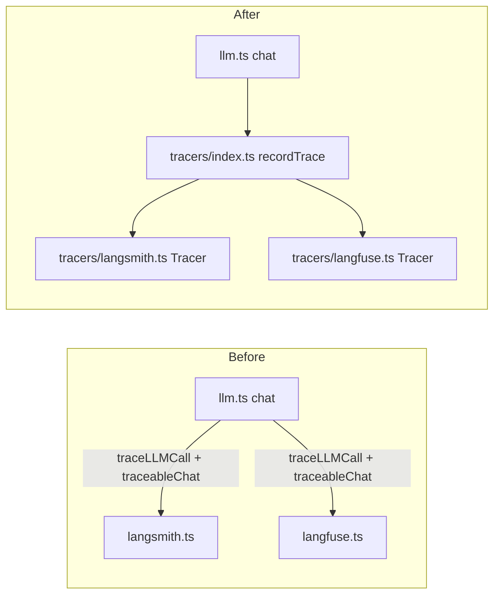

# refactor: Close outstanding code-review todos

## Summary

Four items remain open in `todos/`: one (`010`) is stale and closes with no code change because the code it describes no longer exists. The other three are real, well-scoped internal refactors — unify LangSmith/Langfuse tracing behind one interface, break the `llm.ts ↔ env.ts` circular import, and clear a batch of small chaos-audit findings (including deleting ~450 lines of dead legacy chat-bot code that has zero callers and zero test coverage).

---

## Problem Frame

`todos/000`–`011` are all resolved or closed (verified against their `status:` frontmatter and Work Log entries). `todos/012`, `013`, `014` remain `pending`, filed during the `feature/chaos-audit-2026-07-04` session and deliberately deferred to keep that PR's blast radius small. `todos/010` is also `pending` but its target code (manual `ipv4Regex`/`ipv6Regex` literals in `route.ts`) was replaced by `isIP()` from `node:net` in a later commit (`ede0ad1`) — the finding no longer applies.

This plan closes all four.

## Scope Boundaries

**In scope:**
- Close `todos/010` (no code change — verify and document).
- `todos/012`: unify LangSmith + Langfuse tracing behind a `Tracer` interface; remove `Function`/`any` typings; remove the floating-promise `traceableChat` wrappers.
- `todos/013`: extract `Provider`/`KNOWN_PROVIDERS` to a leaf module (`lib/providers.ts`); delete the `require()`-based circular-import workaround in `lib/env.ts`.
- `todos/014` quick-pass and cleanup-pass items (L1-08, L1-09, L1-10, L1-13, L2-06, L2-08).
- `todos/014` larger-discussion items (L2-04, L2-05, and the `getRelevantContext`/`extractJobTitle`/legacy-RAG code in `knowledge-base.ts`): resolved as **deletion**, not reorganization — see Key Technical Decisions.

### Deferred to Follow-Up Work

- `todos/014` L1-11 (env snapshot semantics for `getRatelimit()`) — explicitly flagged in the todo as needing a product decision on whether runtime env-var mutation should ever recreate the singleton. No current production need; left as-is.
- Any new tracer backend (Datadog, Braintrust, etc.) — the `Tracer` interface in U1 makes this a follow-up "new adapter file" task, not part of this plan.

## Requirements Traceability

| Item | Source | Disposition |
|---|---|---|
| Cache `isValidIp` regex at module scope | `todos/010` | Close, no-op — target code replaced by `isIP()` |
| Unify tracing behind `Tracer` interface, fix typings | `todos/012` | U1 |
| Extract `KNOWN_PROVIDERS` to leaf module | `todos/013` | U2 |
| L1-08 dead try/catch in `isValidDocxBase64` | `todos/014` | U3 |
| L1-09 redundant double-strip in `callDeepSeek` | `todos/014` | U3 |
| L1-10 empty `TextRun`s from pathological `**` input | `todos/014` | U3 |
| L1-13 `resetTime?` type drift | `todos/014` | U3 |
| L2-06 route error-handling ladder as data table | `todos/014` | U4 |
| L2-08 chat-prompt variants scattered at module root | `todos/014` | U4 |
| L2-04 `input-filter.ts` six-policy file | `todos/014` | U5 (deletion) |
| L2-05 two KB loaders differ only in strictness | `todos/014` | U5 (deletion, coupled) |
| L1-11 env snapshot semantics | `todos/014` | Deferred |
| L2-07 `testConnection()` if-chain vs registry | `todos/014` | Deferred — see Key Technical Decisions |

---

## Key Technical Decisions

### KTD1 — Delete dead legacy chat-bot code instead of refactoring it (L2-04/L2-05, and by extension `getRelevantContext`)

**Decision:** Delete `lib/input-filter.ts`, `getRelevantContext()` + its six `isXxxQuery` classifier helpers + `extractJobTitle()` in `app/api/lib/knowledge-base.ts`, and consolidate `loadKBFile`/`loadKBFileStrict` down to the one variant `getAllContext()` actually uses.

**Rationale:** Grepped the full repo (app, lib, scripts, tests) for every symbol in this code path — `input-filter.ts`, `getRelevantContext`, `extractJobTitle`, `loadKBFile` (non-strict variant) — and none has a caller outside `knowledge-base.ts` itself, and none is exercised by any test file. `tests/knowledge-base.test.ts` only tests `getAllContext()`/`loadKBFileStrict`. This is the "legacy chat bot" RAG path the file's own header comment says is "intentionally unused by POST /api/tailor-cv" and kept only "for a future `/api/chat` route." No such route exists in the codebase or in any current plan. Per the todo's own guidance ("Only do this if a `/api/chat` route is being planned; otherwise it's dead code and should be deleted, not reorganized") and AGENTS.md code-simplicity heuristics, splitting or merging dead code is wasted effort — delete it. If `/api/chat` is built later, this logic is fully recoverable from git history.

**Consequence for L2-08:** `chat-prompt.4o-mini.ts`, `chat-prompt.gemini-flash-v0.ts`, `chat-prompt.gemini-flash-v1.ts` are model-versioned prompt experiments for the same legacy path — grep confirms zero imports anywhere. These are deleted alongside, not moved to `prompts/chat/`, for the same reason: moving dead code just relocates the maintenance burden.

### KTD2 — `Tracer` interface shape (todos/012, Option 1)

Adopt the todo's Option 1 exactly: one `Tracer` interface (`isEnabled()`, `record(payload)`), one adapter per provider (`lib/tracers/langsmith.ts`, `lib/tracers/langfuse.ts`), one composite dispatcher (`lib/tracers/index.ts`) that `llm.ts::chat()` calls once on both the success and error paths. Chosen over Option 2 (typing-only fix) and Option 3 (delete-wrappers-only) because both leave the duplication in place — every future tracing change (new field, new provider) would still cost 2×, which is exactly the "80% overlap means extend, don't copy" violation the todo identifies. The `traceableChat` wrappers are deleted (confirmed zero callers via grep) rather than migrated, since `llm.ts::chat()` is the only production entry point.

**Flush semantics preserved exactly as today:** LangSmith stays fire-and-forget (`awaitFlush: false`); Langfuse stays awaited on both success and error paths (`awaitFlush: true`) — this is the serverless-cold-shutdown fix already shipped in the chaos audit and must not regress.

### KTD3 — Provider leaf module (todos/013, Option 1)

Move `Provider` type + `KNOWN_PROVIDERS` to new `lib/providers.ts`. `llm.ts` imports and re-exports both for backward compatibility with existing importers/tests. `lib/env.ts` imports `KNOWN_PROVIDERS` directly and deletes `sanitizeProviderRegistry`, `getConfiguredProviderFallback`, `getProviderRegistry`, `cachedProviderRegistry`, `resetProviderRegistryCache` (the entire `require()`-cycle workaround, ~50 lines). This is a pure risk-reduction move: the fallback path being deleted exists only to paper over a circular import that a leaf module makes structurally impossible.

### KTD4 — L2-07 (`testConnection()` if-chain) deferred, not fixed here

**Decision:** Leave `testConnection()`'s `switch`/if-chain as-is in this plan.

**Rationale:** The todo itself couples L2-07 to "L2-01 provider-registry work" — but L2-01 (a fully data-driven provider registry with per-provider `testConnection` methods) doesn't exist as a filed todo and would be a materially larger change (registry objects carrying behavior, not just names) than U2's scope (moving a `Set<Provider>` to a leaf module). Folding it in here would silently expand U2's blast radius. Recording as an explicit deferral rather than doing it opportunistically.

---

## High-Level Technical Design



```mermaid
flowchart LR
  subgraph Before
    ENV1[lib/env.ts] -- "require() at runtime, try/catch fallback" --> LLM3[app/api/lib/llm.ts]
    LLM3 -- "static import" --> ENV1
  end
  subgraph After
    ENV2[lib/env.ts] -- "static import" --> PROV[lib/providers.ts]
    LLM4[app/api/lib/llm.ts] -- "static import + re-export" --> PROV
    ENV2 -.no edge to llm.ts.-> LLM4
  end
```

---

## Implementation Units

### U1. Unify tracing behind a `Tracer` interface

**Goal:** Single `Tracer` interface with LangSmith/Langfuse adapters and a composite dispatcher; delete duplicated `traceLLMCall` typings and the dead `traceableChat` wrappers.

**Requirements:** `todos/012`, KTD2.

**Dependencies:** None.

**Files:**
- New: `app/api/lib/tracers/tracer.ts` — `TracePayload`, `Tracer` interfaces.
- New: `app/api/lib/tracers/langsmith.ts` — LangSmith adapter (from `langsmith.ts::traceLLMCall`, minus `traceableChat`).
- New: `app/api/lib/tracers/langfuse.ts` — Langfuse adapter (from `langfuse.ts::traceLLMCall`, minus `traceableChat`).
- New: `app/api/lib/tracers/index.ts` — `recordTrace(payload, { awaitFlush })` composite dispatcher.
- Modify: `app/api/lib/llm.ts` — `chat()` success/error paths call `recordTrace` twice (once per flush semantics per KTD2) instead of calling `traceLLMCall`/`traceLLMCallLangFuse` directly.
- Delete: `app/api/lib/langsmith.ts`, `app/api/lib/langfuse.ts` (content moved into `tracers/`).
- New: `tests/tracers.test.ts`.

**Approach:**
- `TracePayload` carries `provider`, `model`, `messages`, `systemPrompt`, `response`, `startTime`, `options: ChatOptions`, `langfusePrompt?: LangfusePromptRef | null` — no `any`, no `Function`.
- Each adapter's `isEnabled()` checks its own env vars (`LANGSMITH_TRACING`/`LANGSMITH_API_KEY`; `LANGFUSE_TRACING`/`LANGFUSE_PUBLIC_KEY`/`LANGFUSE_SECRET_KEY`) — same gating logic as today, just relocated.
- `record()` bodies are the existing `traceLLMCall` implementations verbatim (client init, `startActiveObservation`/`createRun` calls, `flushLangfuseTraces()` for Langfuse), just conforming to the `Tracer` interface signature instead of the current seven-positional-argument function.
- `recordTrace` in `index.ts` filters to `isEnabled()` tracers, then either awaits all via `Promise.allSettled` (Langfuse's `awaitFlush: true` case) or fire-and-forgets each with a `.catch` (LangSmith's case) — preserve the current per-tracer semantics by having `llm.ts` call `recordTrace` once per flush-mode group, not by adding new per-tracer config. Concretely: `chat()` calls `recordTrace({ tracers: [langsmithTracer] }, payload, { awaitFlush: false })` and `recordTrace({ tracers: [langfuseTracer] }, payload, { awaitFlush: true })` — or the composite exposes named exports (`recordLangSmithTrace`, `recordLangfuseTrace`) if that reads cleaner than a generic tracer-list parameter. Implementer's call; either preserves the required flush-semantics split.
- `llm.ts` import lines become `import { recordTrace } from './tracers';` (single import replaces the current two `traceLLMCall` imports).

**Patterns to follow:** Existing `Provider`/`dispatchProvider` pattern in `llm.ts` — one interface, per-integration files, thin composite dispatch — is the direct precedent for this same shape applied to tracers.

**Test scenarios:**
- Happy path: `recordTrace` calls `record()` on an enabled tracer with a well-formed `TracePayload`; assert the tracer's mock `record` receives the exact payload fields.
- Happy path: disabled tracer (`isEnabled()` returns false) is never invoked — assert zero calls.
- Error path: a tracer's `record()` rejects — assert the rejection is caught and logged, and does not propagate to the caller (matches today's `.catch(err => console.error(...))` behavior).
- Integration: `chat()` success path calls both LangSmith (fire-and-forget) and Langfuse (awaited) — assert `chat()`'s returned promise does not resolve before the Langfuse-flagged tracer's `record()` promise resolves, but does not wait on the LangSmith one (regression guard for the serverless cold-shutdown fix).
- Integration: `chat()` error path mirrors the success path's await semantics (this was the exact bug the chaos audit fixed on the LangSmith/Langfuse split — verify it isn't reintroduced by the refactor).
- Type-level: no `any` or `Function` types remain in `tracers/*.ts` (can be asserted via `tsc --noEmit` in CI, or a targeted `grep -n ": any\|: Function"` assertion if the team wants an explicit regression test).

**Verification:** `npm test` passes with the new `tests/tracers.test.ts` in place; `npm run lint` clean; manual: trigger one successful and one failing `chat()` call locally with `LANGFUSE_TRACING=true` and confirm both produce a trace in the Langfuse dashboard (per the todo's own verification note).

---

### U2. Extract `Provider`/`KNOWN_PROVIDERS` to a leaf module

**Goal:** Eliminate the `llm.ts ↔ env.ts` circular import and its `require()`-based fallback.

**Requirements:** `todos/013`, KTD3.

**Dependencies:** None (independent of U1).

**Files:**
- New: `lib/providers.ts` — `Provider` type, `KNOWN_PROVIDERS` const.
- Modify: `app/api/lib/llm.ts` — replace inline `Provider`/`KNOWN_PROVIDERS` declarations with `import { KNOWN_PROVIDERS, type Provider } from '../../../lib/providers'; export { KNOWN_PROVIDERS, type Provider };`.
- Modify: `lib/env.ts` — `import { KNOWN_PROVIDERS } from './providers';` at top; delete `sanitizeProviderRegistry`, `addProviderFromModel`, `getConfiguredProviderFallback`, `cachedProviderRegistry`, `resetProviderRegistryCache`, `getProviderRegistry`; `validateDefaultModel` calls `KNOWN_PROVIDERS.has(provider)` directly.
- Modify: `tests/env.test.ts` — delete the `describe("getProviderRegistry — llm import cycle", ...)` and `describe("getProviderRegistry — invalid KNOWN_PROVIDERS fallback", ...)` blocks (lines ~242–299) and their `envRequire`/`stubLlmKnownProviders`/`Module` import scaffolding; delete the `resetProviderRegistryCache` import.

**Approach:** Mechanical extraction — no behavior change to `validateDefaultModel`'s error messages or `getTailorModel`/`getDefaultLlmModel`/`getEvalJudgeModel`/`getEvalExtractionModel` outputs. The only observable difference is that an invalid provider in `AI_MODEL`/`TAILOR_MODEL`/eval env vars now always throws (registry is always the full, real `KNOWN_PROVIDERS` set) instead of possibly falling back to an env-derived partial set mid-import-cycle — which was already the intended behavior; the fallback only existed to survive the cycle, not as a feature.

**Patterns to follow:** `lib/env.ts`'s existing `getEnvNumber`/`getEnvString`/`getEnvBoolean` — small, focused, side-effect-free exports — is the model for `lib/providers.ts`.

**Test scenarios:**
- Happy path: `getTailorModel()`, `getDefaultLlmModel()`, `getEvalJudgeModel()`, `getEvalExtractionModel()` all still validate against the real provider set and return expected values for each of `openai`, `anthropic`, `google`, `openrouter`, `deepseek` prefixes (covers the two tests kept at lines 242–254).
- Error path: `getTailorModel()`/`getDefaultLlmModel()` throw `Unknown provider "..."` for an unrecognized provider prefix (e.g. `TAILOR_MODEL=fakeprovider/x`) — replaces the deleted fallback-path tests with a direct assertion against the real (now-unconditional) registry.
- Structural invariant: assert `KNOWN_PROVIDERS` imported from `llm.ts` is reference-equal (`===`) to `KNOWN_PROVIDERS` imported from `lib/providers.ts` — proves the re-export doesn't fork the set.
- Regression: grep-based check (can be a plain test using `fs.readFileSync` + regex, or left as a manual verification step) that no `require(` calls remain in `lib/` or `app/api/lib/` `.ts` files.

**Verification:** `npm test` passes; `npm run lint` passes; `grep -rn "require(" lib/ app/api/lib/ --include="*.ts"` returns zero matches.

---

### U3. Chaos-audit quick-pass fixes (L1-08, L1-09, L1-10, L1-13)

**Goal:** Four small, independent bug-class fixes from the chaos audit batch.

**Requirements:** `todos/014` (L1-08, L1-09, L1-10, L1-13).

**Dependencies:** None.

**Files:**
- `app/api/lib/markdown-docx.ts` — L1-08, L1-10.
- `app/api/lib/llm.ts` — L1-09.
- `app/api/lib/rate-limit.ts` — L1-13.
- `app/api/tailor-cv/route.ts`, `scripts/verify-rate-limit.ts` — L1-13 consumer-side, if type change requires it.
- Tests: `tests/markdown-docx.test.ts` (new, if it doesn't exist — check first), `tests/llm-deepseek.test.ts`, `tests/rate-limit.test.ts`.

**Approach:**
- **L1-08:** Replace the `try/catch` in `isValidDocxBase64` with a real check: validate base64 charset with a regex before `Buffer.from`, or simply drop the try/catch since `Buffer.from` doesn't throw — the function should check `buf.length > 4` and the ZIP magic bytes as it does now, but the false-confidence `try/catch` wrapper goes.
- **L1-09:** Per the todo's own resolution guidance — `tests/llm-deepseek.test.ts` calls `callDeepSeek` directly, so the strip must stay inside `callDeepSeek`. Remove the redundant strip from `dispatchProvider`'s deepseek case only (keep it for the other providers, since `callOpenAI`/`callOpenRouter`/`callAnthropic`/`callGoogle` don't independently re-strip).
- **L1-10:** In `parseInlineMarkdown`, after `part.slice(2, -2)`, skip pushing a `TextRun` if the resulting text is empty (both the bold branch and the plain-text branch on an empty non-matching part).
- **L1-13:** Change `RateLimitResult.resetTime?: number` to `resetTime: number` (non-optional) in `rate-limit.ts`. `checkRateLimit` already always sets `resetTime: result.reset` on every return path (success and failure), so this is a type-only tightening — no runtime behavior change. Verify `route.ts` and `scripts/verify-rate-limit.ts` don't need `?? 0` fallbacks removed (they may already treat it as always-present).

**Test scenarios:**
- L1-08: `isValidDocxBase64` returns `false` for a string that isn't valid base64 at all (contains characters outside the base64 alphabet) — previously this either slipped through `Buffer.from`'s lenient parsing or was masked by the dead catch; now assert the real validation path catches it.
- L1-08: `isValidDocxBase64` still returns `true` for a real base64-encoded docx buffer (regression guard).
- L1-10: `parseInlineMarkdown("****")` produces no empty-text `TextRun` (assert `runs.every(r => r.text length > 0)` or equivalent, whatever the `docx` `TextRun` introspection allows — may need to assert via the rendered XML or a text-extraction helper if `TextRun` doesn't expose `.text` directly).
- L1-10: `parseInlineMarkdown("**")` (single unmatched marker) still produces at least one non-empty run and doesn't throw.
- L1-09: `callDeepSeek` called with an already-stripped model string works unchanged (existing test coverage in `llm-deepseek.test.ts` should already assert this — verify, don't duplicate).
- L1-09: `dispatchProvider('deepseek', ...)` with a `deepseek/`-prefixed model still resolves to the correct API model string (single-strip now happens in `callDeepSeek`, not `dispatchProvider`).
- L1-13: TypeScript compile-time check — `route.ts`'s `resetTime: rateLimit.resetTime` usage compiles without an optional-chaining or `?? 0` guard (structural, verified by `tsc --noEmit` passing, not a runtime test).

**Verification:** `npm test` passes; `npm run lint` passes; `tsc --noEmit` passes with `resetTime` non-optional.

---

### U4. Chaos-audit cleanup-pass fixes (L2-06, L2-08)

**Goal:** Turn the route's error-handling if-chain into an auditable data table; delete the now-confirmed-dead chat-prompt variant files (superseded by KTD1 — moving them was the original todo ask, deletion supersedes it).

**Requirements:** `todos/014` (L2-06, L2-08), KTD1.

**Dependencies:** None (independent of U1–U3), but sequence after U1 if both touch `llm.ts` to avoid merge friction — no actual overlap expected since U1 only touches the `chat()` tracing calls.

**Files:**
- `app/api/tailor-cv/route.ts` — L2-06.
- Delete: `app/api/lib/chat-prompt.4o-mini.ts`, `app/api/lib/chat-prompt.gemini-flash-v0.ts`, `app/api/lib/chat-prompt.gemini-flash-v1.ts` — L2-08 (per KTD1, deletion not relocation).
- Tests: `tests/route.test.ts`.

**Approach:**
- **L2-06:** Extract the four `if (error instanceof X)` branches in `route.ts`'s `catch` block into a `[predicate, status, mask]`-shaped table, e.g. `const ERROR_RESPONSES: Array<{ matches: (e: unknown) => boolean; status: number; body: (e: unknown) => Record<string, unknown> }>` iterated in order, falling through to the generic 500. This makes "which errors get their raw message forwarded to the client" (the security-sensitive decision the todo calls out) visible as data in one place instead of interleaved `if` logic.
- **L2-08:** Confirmed via grep (see plan research) that none of the three `chat-prompt.*.ts` variant files are imported anywhere in `app/`, `lib/`, `scripts/`, or `tests/`. Delete them rather than moving to `prompts/chat/` — moving dead code doesn't reduce the maintenance burden the todo is trying to address.

**Test scenarios:**
- L2-06 happy path: `RateLimitError` still maps to 429 with `error.message` forwarded (existing behavior, now driven by the table).
- L2-06: `ServiceError` still maps to 503 with `error.message` forwarded.
- L2-06: `isLlmServiceError(message) === true` still maps to 503 with the generic masked message ("AI service error. Please try again."), not the raw error.
- L2-06: unmatched error still falls through to 500 with the generic masked message.
- L2-06 edge case: table iteration order matters when multiple predicates could match (e.g. a `ServiceError` whose message also happens to match `isLlmServiceError`) — assert the first matching table entry wins, matching today's top-to-bottom `if` precedence.
- L2-08: `npm run build` succeeds with the three files removed (proves nothing imports them — compile-time safety net for the grep-based dead-code claim).

**Verification:** `npm test` passes (all existing `route.test.ts` error-mapping tests pass against the table-driven implementation with no assertion changes); `npm run build` succeeds after file deletion; `npm run lint` passes.

---

### U5. Delete dead legacy chat-bot RAG code (L2-04, L2-05)

**Goal:** Remove `lib/input-filter.ts` and the unused `getRelevantContext`/classifier/`extractJobTitle` code in `knowledge-base.ts`, consolidating to the single KB loader (`loadKBFileStrict`) that production actually uses.

**Requirements:** `todos/014` (L2-04, L2-05), KTD1.

**Dependencies:** None.

**Files:**
- Delete: `lib/input-filter.ts`.
- Modify: `app/api/lib/knowledge-base.ts` — delete `getRelevantContext`, `isExperienceQuery`, `isProjectsQuery`, `isSkillsQuery`, `isCareerStoryQuery`, `isMetaQuery`, `isJobDescriptionQuery`, `extractJobTitle`, `loadKBFile` (non-strict variant); rename `loadKBFileStrict` back to `loadKBFile` if a single-variant name reads cleaner, or leave the name as-is — implementer's call, either is a pure rename with no behavioral effect.
- Modify: file header comment in `knowledge-base.ts` — remove the now-inaccurate reference to `getRelevantContext()` supporting "the legacy chat bot."
- Modify: `app/api/lib/chat-prompt.ts` and `app/api/lib/prompts.ts` header comments — both reference `getRelevantContext()`; update or remove those references since the function no longer exists. Verify with a fresh grep after deletion that no other comment or doc references the deleted symbols.
- Tests: `tests/knowledge-base.test.ts` — no test changes expected (already only tests `getAllContext`), but re-run to confirm.

**Approach:** Straight deletion. `KB_CONFIG` stays (still used by `getAllContext`). `getAllContext()` and `resetKnowledgeBaseCacheForTest()` are unaffected. Grep the repo one final time after deletion for any of the removed symbol names to catch a stray import or comment reference before considering the unit done.

**Test scenarios:**
- Test expectation: none for the deleted code paths — they have zero existing test coverage today (confirmed via grep of `tests/`), and deletion of untested dead code carries no regression risk to assert against.
- Regression: `tests/knowledge-base.test.ts`'s existing `getAllContext` suite (7 tests: missing-file, empty-file, unreadable-file, all-present, caching) passes unchanged — proves the deletion didn't touch the live code path.
- Build check: `npm run build` succeeds (proves nothing outside `knowledge-base.ts` imports the deleted symbols — compile-time safety net matching U4's L2-08 check).

**Verification:** `npm test` passes; `npm run build` succeeds; `npm run lint` passes; `grep -rn "getRelevantContext\|extractJobTitle\|isExperienceQuery\|isProjectsQuery\|isSkillsQuery\|isCareerStoryQuery\|isMetaQuery\|isJobDescriptionQuery" --include="*.ts" .` returns zero matches outside git history.

---

### U6. Close `todos/010` and update todo statuses

**Goal:** Formally close the stale `010` finding and mark `012`, `013`, `014` resolved with Work Log entries, consistent with how `000`–`011` were closed.

**Requirements:** All of the above.

**Dependencies:** U1–U5 complete.

**Files:**
- `todos/010-pending-p3-cache-isvalidip-regex-at-module-scope.md` — add `## Resolution` section documenting that `isValidIp` now uses `isIP()` from `node:net` (commit `ede0ad1`), no manual regex exists to hoist; update frontmatter `status: closed`.
- `todos/012-pending-p2-tracing-unify-adapters-fix-typings.md`, `todos/013-pending-p3-extract-known-providers-leaf-module.md`, `todos/014-pending-p3-chaos-audit-minor-findings-batch.md` — add `## Work Log` entries per this plan's execution; update frontmatter `status: completed`.

**Approach:** Mirror the existing Work Log format used in `todos/006`–`009`, `011` (date, "By:", "Actions:", optional "Learnings:").

**Test scenarios:** Test expectation: none — documentation-only unit.

**Verification:** All four todo files have an accurate, dated resolution record; no `status: pending` remains among `todos/010`, `012`, `013`, `014`.

---

## Risks & Dependencies

- **Tracing regression risk (U1, Medium):** Tracing is observability infrastructure — a bug here causes silent trace loss, not a user-facing failure, which makes it easy to miss in CI. Mitigated by the explicit await-semantics regression tests in U1 and a manual Langfuse-dashboard verification step before merge.
- **Circular-import removal risk (U2, Low):** Deleting the `require()` fallback removes a safety net for a failure mode that should no longer be reachable once the leaf module exists. Mitigated by the `grep -rn "require("` zero-match check and the full `npm test` suite (which already imports `llm.ts` and `env.ts` in the same process, the exact condition that would previously exercise the cycle).
- **Dead-code deletion risk (U4/U5, Low):** Relies on grep-based usage analysis being exhaustive. Mitigated by `npm run build` (TypeScript compilation across the whole `app/`/`lib/` tree will fail loudly on any stray import) as a second, independent verification layer beyond grep.
- **Sequencing:** U1 and U2 are independent and can be done in either order or in parallel. U3, U4, U5 are independent small units. U6 depends on all prior units landing so the Work Log entries describe what actually shipped.

## Sources & Research

- Local repo inspection: `app/api/lib/{llm,langsmith,langfuse,rate-limit,markdown-docx,knowledge-base}.ts`, `lib/{env,input-filter}.ts`, `app/api/tailor-cv/route.ts`, `tests/{env,knowledge-base}.test.ts` — read in full to verify every finding in `todos/010`, `012`, `013`, `014` still reflects current code.
- Grep verification (repo-wide, excluding `node_modules`): confirmed `traceableChat`, `input-filter.ts`, `getRelevantContext`, `extractJobTitle`, and all three `chat-prompt.*.ts` variants have zero callers/importers in `app/`, `lib/`, `scripts/`, or `tests/`.
- `git log` — confirmed `todos/010`'s target regex code was superseded by commit `ede0ad1` (`fix(tailor-cv): harden parseClientIp with node:net and rightmost-only trust`).
- No external research performed — this is a fully internal refactor with strong local precedent (`dispatchProvider`/`Provider` pattern in `llm.ts` is the direct model for U1's `Tracer` interface).
