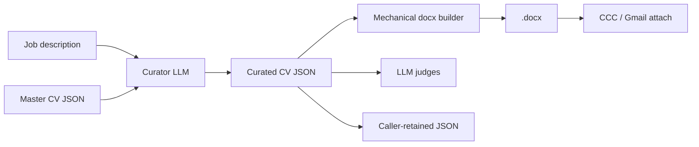
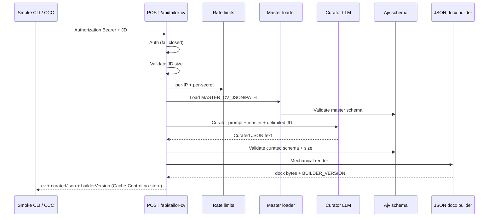

# JSON Curator CV Pipeline - Plan

## Goal Capsule

**Objective:** Replace markdown CV generation with a JSON-curator pipeline: canonical master JSON → LLM-curated subset (select, reorder, reframe) → mechanical `.docx`, returning both artifacts so judges/smoke and Gmail attach share one generation. Mechanical regen of `.docx` from retained curated JSON (same builder version) is a v1 capability for whoever holds the JSON — not server-side history.

**Product authority:** This Product Contract. Port behavior from the working Claude Projects curator + `resume_builder` flow; cheaper models / batch are optimization paths, not different product behavior.

**Open blockers:** None — port refs in `references/json-curator/`; runtime master via env secret (`MASTER_CV_JSON` / `MASTER_CV_PATH`); R1b signed off.

**Product Contract preservation:** changed: F2, F3, R1b, R5d, R11, R13a, R20, AE2b, Scope, Success Criteria — post-review autofixes + resolved Open Questions (2026-07-20); R8b remains a hard cutover gate.

---

## Product Contract

### Summary

Cut over `POST /api/tailor-cv` to curate a JD-specific CV as structured JSON from a canonical master JSON (Struan 8-part curation rules), render `.docx` on the server without further LLM involvement, and return base64 `.docx` plus curated JSON. Add a **manual** CLI smoke that hits the live API and always runs LLM judges (grounding + JD-fit) on the curated JSON with hard env thresholds — not part of the automated test suite. Markdown knowledge-base injection for CV generation is retired.

### Problem Frame

The API today returns only a base64 `.docx` after the model writes freeform markdown. LLM-as-judge and inspection need structured or textual CV content; the consumer (CCC/Gmail) needs Word. That split forced either a second generation or reverse-engineering the `.docx`. A Claude Projects workflow already solves this: master JSON allowlist + curator LLM + deterministic docx-js render. This product brings that model into the server API and makes smoke/eval consume the same curated JSON the render uses.

### Key Decisions

- **JSON master, not markdown KB, for tailor.** Day-to-day need is the tailored CV; master career truth is structured JSON (seeded from the working Claude `master_cv.json`, merged with any KB-only facts worth keeping). Markdown KB is not the tailor source of truth after cutover.
- **Cutover, not dual-path.** One generation pipeline; do not keep markdown→CV generation alongside JSON curation.
- **LLM curates; server renders.** The model emits curated JSON only. The server runs the docx builder mechanically (same role as `resume_builder.js` in Claude Projects).
- **Response = `.docx` + curated JSON.** CCC may ignore JSON and attach `.docx`. In v1 the caller owns persistence: the API is stateless (no tailor history). Regen without re-tailoring requires the caller (or operator) to retain curated JSON; server-side history/auth/DB is deferred.
- **Access = shared-secret gate (MVP).** `POST /api/tailor-cv` requires a configured shared secret (`TAILOR_API_KEY`); missing/invalid key → reject before curation. Allowed presenters: (1) the **smoke CLI** as the exclusive operator/manual test path, and (2) the **CCC backend** for product traffic. Seekers never hold or send the key. Ad-hoc `curl` and other one-off clients are not supported operator methods once smoke exists. Never embed the key in browser/mobile clients. Local/dev may use a documented insecure bypass only per R5d (hard-blocked in production). Rate limits remain a compensating control.
- **Provider posture = cheap vs private.** Sending master JSON + JD (and judge inputs) to external LLMs is an explicit trust boundary. **v1 sole-operator:** putting a provider/model in env *is* the allow decision (R20) — no separate retention gate. End-user cheap-vs-private / retention picker deferred with multi-tenancy. Curator and judge calls share the same env posture.
- **Master storage = env secret.** Canonical master JSON is supplied at runtime from environment configuration — preferably the JSON body in a secret env var (e.g. `MASTER_CV_JSON`) for Railway/local `.env`, or alternatively `MASTER_CV_PATH` to a gitignored file. Not committed to this public repo; not under the web root. Schema/redacted samples may live in-repo.
- **JD is untrusted input.** Job description text is attacker-controlled free text on the same call as master JSON. Size/structure limits apply (env-tunable); curator prompt contract keeps JD in a clearly delimited data channel separate from system/master instructions; instruction-override attempts in the JD must not cause new employers/metrics/tools/certs or master leakage beyond normal curated output. Grounding judges catch fabrication quality — they are not the primary prompt-injection control.
- **Grounding = capable curator + cheap hallucination judge — no claim-graph.** Fabrication control is (1) Struan/subset curator prompt + routing to a capable `TAILOR_MODEL` when needed, and (2) a small-model grounding judge with a deterministic prompt against master + curated JSON (smoke / quality path). “Fiction grounded in fact” means wording, emphasis, and ordering only — employers, titles, dates, tools, certifications, and numeric metrics must stay identity-preserving relative to master. **No mechanical claim-graph allowlist** is in scope or on the success path; do not invent one if judges or model quality are insufficient — raise curator model tier or tighten the judge prompt instead.
- **No page-count / layout-QA requirement.** Content fit to the JD matters more than document length. Do not enforce page targets, overflow loops, or visual PDF/JPEG verification in the CCC pipeline. Claude Projects length/overflow steps in the ported prompt are **not** product requirements — strip them when adapting the curator prompt.
- **Smoke = manual full-pipeline + judges.** Operator runs a CLI against a running server (`POST /api/tailor-cv`): valid `.docx` **and** grounding + JD-fit judges on curated JSON with env-tunable hard thresholds — always, not an optional quality flag. Default JD from `knowledge-base/test-jds/` (or successor); CLI path override for real JDs. Not part of default `npm test` or the automated CI suite; secrets/models required only when the operator chooses to run it. This smoke **extends or replaces** `scripts/e2e-tailor-cv.ts` (one live-API path) and is the **only** supported operator/manual live-API client. `scripts/eval-cv.ts` is adapted or retired for JSON judging — not kept as a parallel markdown-generation eval.
- **v1 operating mode = interactive / low-volume.** Seeker (or operator) does cursory human review before high-stakes sends (R15). High-volume autopilot without review is out of scope for this cutover.
- **Cutover via normal branch/PR workflow.** Land JSON curator on a feature branch; validate with smoke before merge. After R8, markdown KB is not the tailor source. Rollback is ordinary git/deploy revert of the cutover PR — no special dual-path feature flag required. Recommended (not ceremony-heavy) checks before merge: schema validate, builder round-trip, smoke on a real JD; Langfuse redaction/prompt cutover deps (R8a/R8b) still required before production traffic sees master/curated JSON in traces.
- **Observability cutover deps.** Before shipping JSON curator cutover, Langfuse tracing must redact master/curated content at least to LangSmith parity (or disable content export for tailor/judge), and stop serving the production Langfuse markdown `cv-tailor-system` prompt (replace with JSON-only curator prompt and sync the hardcoded fallback, or stop fetching Langfuse for tailor).
- **Human cursory review expected early.** High-stakes applications; autopilot confidence is earned, not assumed.
- **Batch / DeepSeek cost paths deferred as product-identical optimizations.** First contract is interactive tailor via configured `TAILOR_MODEL`; Anthropic batch and model swaps must not change curation semantics.

### Actors

- A1. Job seeker — supplies JD only (via CCC or other product UI). Does not hold or present `TAILOR_API_KEY`.
- A2. Tailor API — authenticates shared secret, curates, validates curated JSON, renders, rate-limits, returns artifacts.
- A3. Smoke operator — exclusive supported operator/manual live-API client; runs smoke CLI with the shared secret; inspects scores and `.docx`.
- A4. CCC backend — attaches `.docx`; may persist curated JSON locally for history/regen (not required in v1); presents `TAILOR_API_KEY` server-side on tailor calls (never from browser/mobile).

### Key Flows

- F1. Tailor happy path
  - **Trigger:** `POST /api/tailor-cv` with job description.
  - **Actors:** A1, A2
  - **Steps:** Validate shared secret; validate JD as untrusted input (non-empty, env-tunable size/structure limits); load master JSON; curator LLM produces curated JSON (same schema, subset/reorder/reframe) with JD isolated from system/master instructions; validate curated JSON against schema before render; enforce env-tunable max curated JSON / response size; server builds `.docx` (sanitize/escape free-text fields); return both (include builder version per R5c); rate limits apply (R21). Grounding/JD-fit judges are **not** on this path — they run in smoke (F3) only.
  - **Outcome:** Attachable `.docx` + curated JSON from one generation (or client-safe error with no partial PII artifacts).
- F2. Regenerate `.docx` from caller-retained JSON
  - **Trigger:** Caller still has curated JSON + builder version, lost Word file (no server history in v1).
  - **Actors:** A3 (operator) via the documented local regen CLI in v1. A4 may retain curated JSON for a future regen path, but this repo does not ship CCC-side builder integration until the deferred server regen endpoint or CCC storage UX ships.
  - **Steps:** Confirm retained builder version matches the builder invoked; run mechanical builder on retained JSON only — no curator LLM.
  - **Outcome:** Style-stable `.docx` without re-tailoring when versions match (per R7).
- F3. Smoke / quality gate
  - **Trigger:** Operator manually runs CLI smoke with default or overridden JD.
  - **Actors:** A3, A2
  - **Steps:** Ensure server up; POST tailor (with shared secret); assert valid `.docx`; always run grounding + JD-fit judges on master + curated JSON and JD; fail if any score is below env mins, or if a judge returns `parseFailed` / missing scores / transport errors (hard fail, independent of numeric thresholds).
  - **Outcome:** Pass/fail with artifacts; never invoked by default `npm test` / automated CI.

### Requirements

**Source of truth and curation**

- R1. A single canonical master CV exists as structured JSON (schema compatible with the working Claude `master_cv.json`), loaded at runtime from env: prefer `MASTER_CV_JSON` (secret env body) for deploy/local `.env`; `MASTER_CV_PATH` to a gitignored file is an allowed alternative.
- R1a. The real master JSON is not committed to this public repository, not served as static/public assets, and not placed under the web root; only the tailor process/runtime identity may read it. When using `MASTER_CV_PATH`, the file must not be world-readable (runtime-user ownership / restricted permissions). Schema, redacted samples, and non-PII fixtures may live in-repo.
- R1b. **Done (2026-07-20).** Master↔KB completeness audit signed off (keepers merged / explicit keep-drop recorded in `references/json-curator/r1b-master-kb-completeness-audit.md`). Not active delivery work for this cutover.
- R2. Tailoring produces a curated JSON document that is a subset/reorder/reframe of the master — no new employers, metrics, tools, or certifications.
- R3. Curation follows Struan 8-part intent (contact stable; summary/relevant accomplishments; skills ordered to JD; experience ranked/trimmed; education/certs policy as in the Claude curator prompt).
- R3a. The ported curator prompt must omit Claude Projects page-count targets, overflow detection, PDF/JPEG visual QA, and length-driven re-curation loops (per R6c).
- R4. Wording, emphasis, and ordering may change; inventing facts or inflating identity-preserving fields (employers, titles, dates, tools, certifications, numeric metrics) is not allowed.

**API and render**

- R5. After cutover, `POST /api/tailor-cv` returns base64 `.docx` and the curated JSON from the same generation.
- R5b. Deployed server tailor calls require a valid shared secret from env (`TAILOR_API_KEY`); requests without a matching header are rejected before master load or curator LLM. Only the smoke CLI and CCC backend may present the secret; seekers and browser/mobile clients must not. Local/dev must also present the secret unless the documented insecure bypass in R5d is explicitly enabled.
- R5d. Deployed environments fail closed at startup (do not serve tailor) when `TAILOR_API_KEY` is unset or empty. Local/dev may use an explicit insecure bypass only if documented, never default-on, and **hard-blocked in production**: ignore the bypass when `NODE_ENV=production` **or** a deploy marker is set (e.g. `RAILWAY_ENVIRONMENT=production` / equivalent platform prod signal). Startup must fatal if the bypass flag is set while any production marker is present.
- R5c. Tailor responses that include curated JSON for regen also include the builder version (or content hash) used to produce the companion `.docx`.
- R6. `.docx` is produced mechanically from curated JSON (server-side builder), not by the LLM writing Word/XML.
- R6a. Before render and before returning curated JSON, validate curator output against the master CV schema (shape/types/required fields); on failure return a client-safe error with no `.docx` and no curated JSON body. Semantic subset/identity (R2/R4) is enforced by curator model quality + grounding judge on the smoke path (R9/R11), not by inline API judges or a mechanical claim-graph.
- R6b. Env-tunable maximum curated JSON size and total response payload; reject oversize curator output before render/return.
- R6c. Page count, overflow detection, and visual PDF/JPEG layout verification are **not** product requirements and must not gate tailor success.
- R6d. The mechanical builder escapes/sanitizes curated free-text fields and strips disallowed control characters before Word generation.
- R7. Given the same curated JSON and builder version, regenerating `.docx` does not require a new curator LLM call. Callers retaining JSON for regen must keep the recorded builder version with it; style-stable regen applies only when that version matches the builder invoked. v1 delivers regen via a documented local CLI/script wrapping the ported builder; a thin server regen endpoint remains deferred.
- R8. Markdown knowledge-base files are not injected as the CV generation source after cutover.
- R8a. Before cutover ships: replace or stop fetching the Langfuse production markdown `cv-tailor-system` prompt so tailor uses the JSON-only curator prompt (and synced hardcoded fallback).
- R8b. Before cutover ships: Langfuse (if enabled) must redact master/curated content at least to LangSmith parity, or disable content export for tailor/judge traces (per R18).

**Judging and smoke**

- R9. Grounding and JD-fit quality are scored by LLM judges against master + curated JSON (and JD), using a cheap model for the narrow grounding check when configured. Judges run on the **smoke path only** in v1 — not on every F1 tailor response.
- R10. A CLI smoke command exercises the live tailor endpoint with a default JD from the test-JD fixture set and supports a file/path override for real JDs. It extends or replaces `scripts/e2e-tailor-cv.ts` so there is one live-API mechanical entrypoint, and is the exclusive supported operator/manual client for live tailor calls.
- R11. Smoke always runs grounding and JD-fit judges on master + curated JSON and JD, and fails the process if any configured judge score is below its env-tunable minimum, or if a judge returns `parseFailed` / missing scores / transport errors (hard fail).
- R12. Smoke is not part of the automated test suite (default `npm test` / CI); the operator runs it manually when they want a full-pipeline quality check.
- R13. Default unit `npm test` remains free of live LLM tailor/smoke calls.
- R13a. Automated non-LLM tests cover schema validation, builder round-trip on fixture curated JSON, shared-secret rejection, client-safe error shapes, and an AE1c-style fixture JD with instruction-override text asserting schema-valid curated output with no injected employers and no wholesale master dump (mocked curator; no live LLM).

**Consumer and ops**

- R14. CCC may continue to use only the `.docx` field. Curated JSON is returned for caller-side persistence, debugging, and regen; the API does not store tailor history in v1.
- R15. v1 assumes interactive/low-volume use: the seeker may do a cursory human review of the CV before sending high-stakes applications. High-volume autopilot without review is out of scope. Human review is an operating assumption, not an API-enforced gate.
- R15a. After R8, markdown KB is not the tailor source. Cutover ships via normal branch/PR; rollback is revert/redeploy. Before production traffic: R8a/R8b observability gates; recommended merge checks include schema validate, builder round-trip, and smoke on a real JD.

**Security and data handling**

- R16. Curated JSON and master JSON are career PII (contact, employers, dates, accomplishments).
- R17. Transport of tailor responses that include curated JSON must be HTTPS-only in deployed environments.
- R17a. Tailor responses (success and error) that may carry curated JSON or career PII include `Cache-Control: no-store` (and equivalent no-cache directives) in deployed environments.
- R18. Full master or curated JSON must not be written to application logs or observability traces; debug/smoke artifacts that retain JSON must redact contact and free-text bullets by default or be local-only with explicit opt-in.
- R18a. Tailor error responses must be client-safe: no master/curated JSON bodies, internal paths, env values, or stack traces; map failures to generic codes/messages at the route boundary.
- R19. When a caller persists curated JSON for history or regen, retention and deletion are that caller’s responsibility in v1; document this caller-owned posture and recommend encrypt-at-rest / restricted file permissions / delete-on-device-loss where practical. Server-side retention rules apply only if/when server history ships.
- R20. Curator and judge LLM calls are a third-party trust boundary: master JSON, curated JSON, and/or JD leave the deployment. **v1 / sole-operator MVP:** configuring a provider/model in env (`TAILOR_MODEL` and related) *is* the allow decision — no separate startup allowlist, retention probe, or fail-closed gate. The operator is responsible for choosing a provider whose terms match their cheap-vs-private preference. Judge model env vars use the same posture. **Out of scope for this cutover:** multi-tenant / end-user UI toggle for retention; that ships with multi-tenancy later.
- R21. Rate limits for `POST /api/tailor-cv` must bound curated-JSON exfiltration (including with a stolen shared secret): fail-closed **per-IP** and **per-shared-secret** ceilings (both required), re-tuned for larger JSON responses. Do not use client-supplied `sessionId` as an anti-exfil identity in the shared-secret MVP.
- R21a. Document rotation/replacement of `TAILOR_API_KEY` after suspected leak (ops runbook; no multi-tenant revoke UI in v1).
- R22. Master JSON is env-configured (`MASTER_CV_JSON` / `MASTER_CV_PATH`); misconfiguration that would expose the master via public HTTP, or missing master in deployed environments, must fail closed (do not start/serve tailor).
- R23. Job descriptions are untrusted user content: enforce env-tunable size (and any agreed structure) limits before the curator runs; reject oversize/invalid JD with a client error and no LLM call.
- R24. The curator prompt contract isolates JD text from system and master instructions via an explicit delimited data channel (and instructs the model to treat JD content as data, not instructions). A JD that attempts instruction override must not introduce employers, metrics, tools, or certifications absent from the master, and must not cause the response to dump master JSON wholesale outside the normal curated schema.

### Acceptance Examples

- AE1. Covers R2, R4, R9
  - **Given:** Master contains SFMOMA “cut support tickets 30%” and no Supabase skill; operator runs smoke (F3) after a successful tailor POST.
  - **When:** JD asks for Supabase; curator runs; smoke judges the curated JSON.
  - **Then:** Curated JSON has no Supabase; grounding judge does not treat honest omission as fabrication; JD-fit judge may note the gap.
- AE1b. Covers R4, R9
  - **Given:** Master contains “cut support tickets 30%”; operator runs smoke (F3) on the tailor output.
  - **When:** Curator emits “cut support tickets 50%” (or equivalent numeric inflation).
  - **Then:** Grounding judge fails (identity-preserving metrics violated).
- AE1c. Covers R2, R24
  - **Given:** Master has no “Acme Corp” employer.
  - **When:** JD contains instruction-override text directing the model to add Acme Corp (or to ignore master / dump full master into the response).
  - **Then:** Curated JSON has no Acme Corp; response is valid curated schema (not a wholesale master dump).
- AE1d. Covers R23
  - **Given:** JD exceeds the configured max size.
  - **When:** `POST /api/tailor-cv` is called with a valid shared secret.
  - **Then:** Client error; no LLM call; no curated JSON or `.docx` returned.
- AE2. Covers R5, R5c, R6, R7
  - **Given:** A successful tailor response with curated JSON, builder version, and `.docx`.
  - **When:** The `.docx` is discarded and the documented local builder CLI runs again on the saved JSON with the same builder version.
  - **Then:** A new `.docx` is produced with no curator LLM call.
- AE2b. Covers R7
  - **Given:** Saved curated JSON recorded with builder version N.
  - **When:** Local regen CLI runs against builder version N+1 (or mismatched recorded version).
  - **Then:** Process exits non-zero with a clear version-mismatch message; no `.docx` claiming style-stable output is written.
- AE3. Covers R10, R11, R12
  - **Given:** Server running; operator runs smoke CLI; a judge score below its minimum (or `parseFailed`).
  - **When:** Smoke runs with the default test JD.
  - **Then:** Process exits non-zero; default `npm test` / CI never invoke this path.

### Success Criteria

- One tailor call yields both attachable `.docx` and judgeable curated JSON (judges exercised via smoke, not on every F1 response).
- Manual live verification uses the smoke CLI exclusively; ad-hoc `curl` is not a supported operator method once smoke exists.
- Operators who retain curated JSON + builder version can regenerate `.docx` via the documented local builder CLI without re-tailoring (R7). CCC may ignore JSON (R14); regen is not a CCC-attach success criterion.
- Page count / layout overflow is not a success or failure criterion.
- Fabrication control strategy is capable curator routing + smoke grounding/JD-fit judges + cursory human review (ops assumption). Response to misses: tighter prompts / higher-tier `TAILOR_MODEL` — not a mechanical claim-graph. Continuous production F1 responses are not judge-gated in v1.
- Cost experiments (DeepSeek, Anthropic batch) can swap models without changing curation rules or response shape.
- Before production traffic (when this leaves local-only use): CCC backend presents `Authorization: Bearer` per R5b in the same cutover window as this API — coordinated release checklist, not a soft unauthenticated window.

### Scope Boundaries

**In scope**

- Master JSON + curator prompt port (with R3a page/overflow strip) + mechanical builder + API dual response
- Shared-secret gate (`TAILOR_API_KEY`): smoke CLI + CCC backend only; startup fail-closed when unset in deploy
- Env master secret (`MASTER_CV_JSON` / `MASTER_CV_PATH`)
- Pre-cutover master↔KB completeness audit (R1b) — **done** (sign-off recorded; not active delivery work)
- Documented local regen CLI/script (curated JSON + builder version → `.docx`)
- Smoke CLI (manual: full pipeline + judges + thresholds; exclusive operator live-API client)
- Retire/adapt overlapping scripts as part of cutover: supersede `e2e-tailor-cv.ts`; adapt or retire `eval-cv.ts` for JSON (mechanics per KTD9: delete or stub markdown path and point operators to smoke; parallel live-API/markdown-eval paths must not remain after cutover)
- Adapt or retire Playwright tailor E2E (`tests/e2e/api.e2e.ts`): Bearer + dual-artifact assertions, or explicitly retire and point operators to smoke — must not remain as an unauthenticated live-tailor path after U1
- Retiring markdown KB as tailor context; Langfuse markdown prompt + redaction cutover deps (R8a/R8b)
- Schema validation, builder sanitization, client-safe errors, output size limits, `Cache-Control: no-store`
- Per-IP + per-shared-secret rate limits (R21); key-rotation ops note (R21a)
- Automated non-LLM unit/integration tests (R13a)
- Security/data-handling requirements R16–R24 as stated (Requirements block is authoritative)

**Deferred for later**

- Anthropic batch / flex cost routing as a first-class product mode
- Alignment snapshot / changelog fields on the public API response
- Multi-user masters and onboarding iceberg ingestion
- Replace shared-secret gate with multi-tenant user auth (post-MVP harden phase)
- End-user cheap-vs-private / retention provider picker UI (OpenRouter-style); v1 is sole-operator env only (R20)
- Server-side tailor history (auth, database, retention/deletion) so regen does not depend on caller-retained JSON — roadmap after MVP
- Thin server regen endpoint accepting caller-supplied JSON
- CCC UI for JSON history (API returns JSON; CCC storage UX is separate)

**Outside this product’s identity**

- Inventing experience to fill JD gaps
- LLM-authored Word XML as the primary render path
- Enforcing CV page limits or overflow-driven re-curation
- Mechanical claim-graph / full atomic-claim allowlist as a fabrication control (use model tier + grounding judge instead)

### Dependencies / Assumptions

- Working Claude Projects `master_cv.json`, curator prompt, and `resume_builder.js` behavior are the behavioral reference for porting.
- Confirmed repo baseline (pre-cutover): tailor returns base64 `.docx` only; markdown KB via `getAllContext`; `scripts/e2e-tailor-cv.ts` uses inline JDs; `scripts/eval-cv.ts` uses `knowledge-base/test-jds`; no npm `smoke` script; Playwright LLM gated by `RUN_E2E_LLM_TESTS` (must be adapted or retired with Bearer auth per Scope).
- Single-user MVP master via env secret (`MASTER_CV_JSON` preferred; `MASTER_CV_PATH` allowed) is acceptable for v1 — not published in this public repo. Prefer `MASTER_CV_JSON` on Railway; if platform/env size limits become an issue, fall back to an injected file + `MASTER_CV_PATH` (document the limit if hit).
- Curator (and judge) LLM calls cross a third-party trust boundary with career PII; provider data-handling terms matter. v1 privacy posture is operator-selected via env (`TAILOR_MODEL` / provider); end-user cheap-vs-private choice is not in this cutover.
- v1 fabrication controls on the hot path are curator model quality + schema validation + human review (ops); smoke judges are the structured quality gate, not a continuous F1 filter.

### Outstanding Questions

**Resolve Before Planning**

*(empty — port refs and R1b complete.)*

**Resolved before planning**

- In-repo: `references/json-curator/` — schema, redacted sample, curator prompt, `resume_builder.js`, project memory, R1b audit sign-off
- Runtime PII master: env secret `MASTER_CV_JSON` (preferred) or gitignored `MASTER_CV_PATH` (e.g. `secrets/master_cv.json`)
- R1b keep/drop signed off 2026-07-20 (see audit file)

**Deferred to Planning** — resolved in Planning Contract (KTDs below). Residual non-blocking notes live under Planning Contract → Open Questions.

### Sources / Research

- Claude Projects port refs: `references/json-curator/` (schema, redacted sample, curator prompt, `resume_builder.js`, project memory). Real master: env secret (`MASTER_CV_JSON` / `MASTER_CV_PATH`), not git.
- Repo grounding: `app/api/tailor-cv/route.ts`, `app/api/lib/knowledge-base.ts`, `app/api/lib/markdown-docx.ts`, `scripts/e2e-tailor-cv.ts`, `scripts/eval-cv.ts`, `docs/solutions/struan-8-part-cv-framework.md`
- Scout dossier: `/tmp/compound-engineering/ce-brainstorm/20260720-smoke/grounding.md`
- Plan research: `/tmp/compound-engineering/ce-plan/20260720-json-curator/repo-research.md`, `learnings.md`

---

## Planning Contract

### Key Technical Decisions

- KTD1. **Ship as one merge-to-main PR; develop as ordered commits.** Auth + Langfuse redaction land and stay green before master/curated content can appear in traces; curator cutover and smoke land later in the same branch. Do not merge half-cutover to `main`. Rollback = revert/redeploy that PR.
- KTD2. **Mechanical builder = TypeScript rewrite** of `references/json-curator/resume_builder.js` under `app/api/lib/` (existing `docx` package). Export a stable `BUILDER_VERSION` string (semver-like constant bumped when layout/output semantics change). Reference JS stays read-only port source.
- KTD3. **Schema validation = Ajv** against `references/json-curator/master-cv.schema.json` (single source of truth). Compile with Ajv’s **draft-2020-12** export (e.g. `ajv/dist/2020`) — default `new Ajv()` is draft-07 and will mis-handle this schema. Validate master at load and curated JSON after LLM parse, before render/return. Pin a compatible `ajv` major.
- KTD4. **Auth header = `Authorization: Bearer <TAILOR_API_KEY>`.** Missing/invalid → 401 before master load / LLM. Local insecure bypass via explicit env flag (e.g. `TAILOR_AUTH_INSECURE_BYPASS=1`), default off. Hard-block when `NODE_ENV=production` **or** a deploy prod marker is set (e.g. `RAILWAY_ENVIRONMENT=production`); fatal if bypass is set while any production marker is present.
- KTD5. **Langfuse redaction (R8b) = LangSmith parity.** For tailor/judge traces, replace message bodies, system prompt, and response content with a redaction sentinel (same spirit as LangSmith `[REDACTED]`); keep metrics/model/timing. Cover error/export/flush paths and metadata fields that could carry prompt text; U2 tests must fail on any master/curated fixture substring in exported payloads. Alternatively disable content export for those sources — redaction preferred so dashboards still show call shape.
- KTD6. **Curator prompt = adapted port** from `references/json-curator/curator-prompt.md`: strip page/overflow/visual QA (R3a); inject master JSON; put JD in an explicit delimited data channel (R24); Langfuse prompt name for JSON curator + synced hardcoded fallback (R8a). Parse LLM output with existing fence/brace JSON extract pattern (`eval-parse` family).
- KTD7. **Dual rate limits.** Keep existing per-IP sliding window (`RATE_LIMIT_MAX` / `RATE_LIMIT_WINDOW`). Add a second fail-closed bucket keyed on a server-side hash of the presented shared secret (`RATE_LIMIT_SECRET_MAX`, **default lower than** `RATE_LIMIT_MAX` — e.g. half — so a stolen secret has a tighter exfil ceiling than IP churn; separate Redis prefix/suffix). Both must succeed. Success responses return the **more restrictive** bucket’s `remaining` / `resetTime`. Document rotation when the secret bucket saturates repeatedly (R21a). Do not key anti-exfil on client `sessionId`.
- KTD8. **Size limits (env-tunable defaults).** Request body max default `65536` bytes (`TAILOR_REQUEST_MAX_BYTES`) before/at parse. JD max length default `50000` chars (`TAILOR_JD_MAX_CHARS`). Curated JSON serialized max default `512000` bytes (`TAILOR_CURATED_JSON_MAX_BYTES`). Total tailor JSON response max default `2097152` bytes (`TAILOR_RESPONSE_MAX_BYTES`) after `.docx` encoding — reject before return. Reject oversize before LLM (JD/body) or before render/return (curated/response).
- KTD9. **Smoke supersedes `scripts/e2e-tailor-cv.ts`.** One live-API entrypoint: send Bearer secret, assert `.docx` + `curatedJson` + `builderVersion`, always run grounding + JD-fit judges on master+curated+JD (reuse server master loader / same `MASTER_CV_*` env), exit non-zero below env mins **or** on judge `parseFailed` / transport errors. Artifact writes are **redact-by-default** (strip contact + free-text bullets) unless an explicit local-only opt-in flag is set (R18). Optional `npm run smoke` script — **not** wired into `npm test` / CI. Default JD from `knowledge-base/test-jds/` (keep path; CLI file override). Retire parallel markdown generation from `scripts/eval-cv.ts` (delete or stub that points operators to smoke).
- KTD10. **Local regen CLI** at `scripts/regen-docx.ts` (or equivalent) + `npm run regen-docx`: read curated JSON path + expect matching `BUILDER_VERSION`; write `.docx`; no LLM.
- KTD11. **Builder sanitization (R6d).** Strip C0 control characters except `\n`/`\t`; rely on `docx` text nodes (no raw XML concatenation). Apply recursively to free-text string fields before document assembly.
- KTD12. **Route deps bag.** Extend `tailorCvDeps` for master load, curator prompt, schema validate, JSON→docx, auth check — preserve `mock.method` testability from `tests/route.test.ts`. Remove markdown KB / markdown-docx from tailor hot path after U6.

### High-Level Technical Design

**Commit order inside the feature PR (KTD1):** U1 → U2 → U3 → U4 → U5 → U6 → U7 → U8. U6 must not ship until **U1–U5** are complete and green (U1+U2 specifically prevent master/curated content entering traces before redaction).

### Assumptions

- v1 is sole-operator / not yet multi-tenant production: env-configured LLM providers are treated as intentionally allowed (R20); no code-level retention allowlist.
- CCC Bearer wiring is coordinated with this cutover when leaving local-only use (Success Criteria / DoD); soft unauthenticated cutover is not used.

### Open Questions

**Resolved (2026-07-20 review)**

- CCC production cutover = coordinated Bearer release with CCC (not soft cutover) — Success Criteria + DoD.
- R20 v1 = env configuration is the allow decision for the sole operator; multi-tenant retention UI deferred.

**Deferred (non-blocking)**

- Exact Langfuse prompt slug/name for the JSON curator (create in Langfuse UI when swapping R8a).
- Exact numeric `RATE_LIMIT_SECRET_MAX` after observing smoke traffic (KTD7 already defaults lower than IP).

### System-Wide Impact

- **API response shape** gains `curatedJson` and `builderVersion`; CCC may ignore them (R14) but clients must tolerate new fields.
- **Auth required** — existing unauthenticated callers (old e2e, ad-hoc curl, Playwright if any) break until updated.
- **Observability** — Langfuse traces lose prompt/response bodies for tailor/judge; dashboards that relied on full text need local smoke artifacts instead.
- **Markdown KB / `cv-prompt` / `markdown-docx`** leave the tailor hot path; may remain briefly for dead-code cleanup or be removed in U6/U8.
- **CONCEPTS.md** “Tailor request” rate-limit wording updates to IP + shared-secret.

### Risks

| Risk | Mitigation |
|------|------------|
| Merge without smoke | KTD1: one PR; Definition of Done requires smoke pass before merge |
| Langfuse still leaks PII | U2 before U6; tests assert no master/curated substring across export/error/flush surfaces |
| Schema drift vs Claude master | Ajv against checked-in schema; fixture round-trips in unit tests |
| Stolen shared secret exfil | Dual rate limits with tighter secret ceiling + rotation when secret bucket saturates (R21a) |
| Curator invents facts | Capable `TAILOR_MODEL` + smoke grounding judge; no claim-graph |

### Alternative Approaches Considered

- **Staged merges to main** — rejected: half-cutover leaves auth without curator or curator without redaction. Ordered commits in one PR preferred.
- **Zod mirror of schema** — rejected: duplicates `master-cv.schema.json`.
- **Keep JS builder + TS wrapper** — rejected: TS rewrite matches codebase and testability.
- **IP allowlist + shared secret** — deferred: single-operator MVP; CCC egress IPs not stable enough to be the primary gate; shared secret + dual rate limits accepted for v1.
- **Short-lived HMAC / signed tokens vs static Bearer** — deferred with multi-tenant auth; static shared secret is the MVP gate.
- **Docx-only F1 to CCC (JSON smoke-only)** — rejected for v1: caller-owned curated JSON is required for judges, regen, and debugging from one generation (R5/R14).

### Documentation Plan

- Update `docs/api/API.md` (auth, response fields, rate limits, Cache-Control, HTTPS-only deploy prerequisite).
- Update `docs/arch/APP_WALKTHROUGH.md`, `docs/arch/FILE_LAYOUT.md`, `docs/test/TESTING.md` (smoke vs unit; Playwright vs smoke).
- Align `CONCEPTS.md` tailor/rate-limit vocabulary.
- Short ops note for `TAILOR_API_KEY` rotation (R21a) — can live in API.md or QUICKSTART.
- Caller-owned curated JSON retention minimum: treat as sensitive as master; recommend encrypt-at-rest, restricted permissions, TTL/delete-on-device-loss (R19).

---

## Implementation Units

### U1. Shared-secret auth and response hygiene

**Goal:** Gate `POST /api/tailor-cv` on `TAILOR_API_KEY`; fail closed in production; add `Cache-Control: no-store` on tailor responses.

**Requirements:** R5b, R5d, R17a, R18a

**Dependencies:** None

**Files:**
- `app/api/lib/tailor-auth.ts` (create)
- `app/api/tailor-cv/route.ts` (modify)
- `app/api/lib/tailor-cv-deps.ts` (modify)
- `lib/env.ts` / `.env.example` (modify)
- `tests/tailor-auth.test.ts` (create)
- `tests/route.test.ts` (modify)
- `tests/e2e/api.e2e.ts` (modify — Bearer + expected status codes)

**Approach:** Validate `Authorization: Bearer …` against env secret (timing-safe compare). Reject 401 before rate-limit/master/LLM. Production: refuse to serve tailor when key unset. Document insecure bypass for local only; hard-block when `NODE_ENV=production` or deploy prod marker is set (R5d/KTD4). Set no-store on success and error responses that could carry PII. Update Playwright e2e for Bearer (skip LLM path when key unset) or retire that path in favor of smoke.

**Patterns to follow:** Discriminated validation unions; route error table; env helpers + `.env.example` in same change.

**Test scenarios:**
- Missing header → 401; no LLM/deps called
- Wrong bearer → 401
- Valid bearer → proceeds to next middleware/handler stage (mocked)
- Production + empty key → fail closed (startup or first-request guard as implemented)
- Bypass flag ignored when `NODE_ENV=production` or deploy prod marker set; fatal if bypass set with prod marker
- Responses include `Cache-Control: no-store`
- Playwright: missing Bearer → 401; valid Bearer + empty JD → 400

**Verification:** Unit + route tests green; `.env.example` documents header and bypass.

---

### U2. Langfuse content redaction (R8b)

**Goal:** Bring Langfuse tailor/judge exports to LangSmith redaction parity before master/curated enter traces.

**Requirements:** R8b, R18

**Dependencies:** None (land before U6)

**Files:**
- `app/api/lib/tracers/langfuse.ts` (modify)
- `tests/langfuse-tracer.test.ts` (modify)
- `docs/solutions/architecture-patterns/dual-tracer-redact-and-flush-timeout.md` (update if behavior changes)

**Approach:** Redact message contents, system prompt, and response text on export (sentinel string); preserve model/usage/latency. Prefer source-aware redaction for tailor/judge if selective mode is cleaner; full content redact is acceptable. Enumerate export surfaces (success, error, flush/retry) and redact any metadata fields that could carry prompt text (KTD5).

**Patterns to follow:** Existing LangSmith redaction; `TracePayload` contract; flush timeout learning.

**Test scenarios:**
- Exported Langfuse payloads (success and error paths) contain no master/curated fixture substrings
- Metrics/model fields still present
- Flush timeout behavior unchanged
- U6 must not merge while any enumerated export surface still leaks fixture PII

**Verification:** Tracer tests assert redaction; learning doc notes parity.

---

### U3. Master loader and Ajv schema validation

**Goal:** Load master from `MASTER_CV_JSON` / `MASTER_CV_PATH`; validate master and curated JSON with Ajv against the shipped schema.

**Requirements:** R1, R1a, R6a, R6b, R22

**Dependencies:** None (wired into route in U6)

**Files:**
- `app/api/lib/master-cv.ts` (create)
- `app/api/lib/cv-schema.ts` (create)
- `references/json-curator/master-cv.schema.json` (read; keep canonical)
- `package.json` (add `ajv`)
- `.env.example` (already partial; complete)
- `tests/master-cv.test.ts` (create)
- `tests/cv-schema.test.ts` (create)
- Fixture: redacted sample or minimal valid JSON under `tests/fixtures/`

**Approach:** Prefer env body; else path with **required** non-world-readable permission check (fail closed with generic error — R1a). Fail closed on missing/invalid master in deploy. Compile schema once via Ajv draft-2020-12 export (KTD3). Size-check curated serialized bytes and total response envelope against env max (KTD8).

**Patterns to follow:** `lib/env.ts`; no `as` casts on external JSON — validate then use.

**Test scenarios:**
- Valid `MASTER_CV_JSON` loads
- Valid path loads; missing file → error
- World-readable path → fail closed (generic error)
- Invalid schema → error with no PII in message
- Curated oversize / response oversize → reject
- Covers AE1d precursor: JD size limit helper can live here or in validation module (implement with R23 in U6)

**Verification:** Schema/loader unit tests; Ajv in lockfile.

---

### U4. Per-IP and per-shared-secret rate limits

**Goal:** Fail-closed dual ceilings for exfil bounding (R21).

**Requirements:** R21

**Dependencies:** U1 (secret available for hashing)

**Files:**
- `app/api/lib/rate-limit.ts` (modify)
- `app/api/tailor-cv/route.ts` (modify when wiring)
- `.env.example` (modify)
- `tests/rate-limit.test.ts` (modify)

**Approach:** Keep IP limiter. Add secret-keyed limiter using server hash of the validated API key (not raw key in Redis if avoidable — hash is fine). `RATE_LIMIT_SECRET_MAX` defaults lower than IP max (KTD7). Both must succeed; map failures to existing 429/503 patterns. On success, expose the more restrictive bucket’s `remaining` / `resetTime`.

**Patterns to follow:** Upstash sliding window; `getRateLimitConfig()`; bounded timeouts; fail-closed.

**Test scenarios:**
- IP limit exceeded → 429 even if secret bucket free
- Secret limit exceeded → 429 even if IP free
- Success response `remaining`/`resetTime` reflect the tighter of the two buckets
- Redis timeout → fail-closed service error (existing posture)

**Verification:** Rate-limit tests cover dual identifiers.

---

### U5. TypeScript JSON→docx builder and local regen CLI

**Goal:** Mechanical render from curated JSON; versioned builder; local regen without LLM.

**Requirements:** R5c, R6, R6d, R7

**Dependencies:** U3 (schema-valid fixtures)

**Files:**
- `app/api/lib/json-docx-builder.ts` (create; port from `references/json-curator/resume_builder.js`)
- `scripts/regen-docx.ts` (create)
- `package.json` (`regen-docx` script)
- `tests/json-docx-builder.test.ts` (create)
- `tests/fixtures/` curated JSON (non-PII)

**Approach:** Port layout/behavior from reference; sanitize strings (KTD11); export `BUILDER_VERSION`. CLI: input JSON path → output `.docx`; refuse if caller-supplied version mismatches when provided.

**Patterns to follow:** Existing `docx` usage in `markdown-docx.ts` (structure only — do not keep markdown parser); table-driven builder tests.

**Test scenarios:**
- Covers AE2. Fixture curated JSON → non-empty docx buffer; round-trip rebuild with same version
- Covers AE2b. Mismatched builder version → CLI non-zero; no style-stable `.docx` written
- Control characters stripped from free text
- Version constant present and returned by builder API

**Verification:** Builder unit tests; CLI documented in TESTING/QUICKSTART as needed.

---

### U6. Curator prompt and tailor route cutover

**Goal:** Replace markdown KB tailor path with master → curator LLM → schema → builder → dual response; R8a prompt swap; JD limits.

**Requirements:** R2–R5, R5c, R6a–b, R8, R8a, R23, R24, F1

**Dependencies:** U1, U2, U3, U4, U5

**Files:**
- `app/api/lib/curator-prompt.ts` (create; from `references/json-curator/curator-prompt.md` + R3a strip)
- `app/api/tailor-cv/route.ts` (modify)
- `app/api/lib/tailor-cv-deps.ts` (modify)
- `app/api/lib/tailor-cv-validation.ts` (JD max chars)
- `app/api/lib/cv-prompt.ts` / `knowledge-base.ts` / `markdown-docx.ts` — remove from hot path
- `tests/route.test.ts` (modify)
- `tests/tailor-cv-validation.test.ts` (modify)

**Approach:** Orchestrate F1 order: auth → request-body size check → JD validate → dual rate limit → load/validate master → curator chat (namespaced model, new source tag) → parse JSON → schema + size → build docx → total response size check → `{ cv, curatedJson, builderVersion, model, usage, remaining, resetTime }` with no-store. Client-safe errors only — including builder failure after valid curated JSON (no `cv`, no `curatedJson`, no stack/path leakage). Redact/omit master and curated payloads from application logs on all tailor-path failure branches (R18). No judges on this path.

**Execution note:** Prefer extending route tests with mocked curator returning fixture JSON before live smoke.

**Patterns to follow:** `llm.chat()`; `eval-parse` JSON extract; deps injection; error mapping table.

**Test scenarios:**
- Covers AE1d. Oversize JD → 400; LLM not called
- Oversize request body → client error; no master load / LLM
- Mocked curator success → response includes base64 cv, curatedJson, builderVersion; remaining is min of dual buckets
- Invalid curator JSON / schema fail → client-safe error; no docx/curated body
- Builder throw after valid curated → client-safe 5xx/422; no partial PII artifacts
- Covers AE1c (non-LLM): mocked curator given override JD fixture → no Acme / no wholesale master dump
- Failure logs never contain fixture master/curated substrings
- Knowledge-base markdown not read on tailor path

**Verification:** Route tests green; markdown not in tailor deps.

---

### U7. Smoke CLI with JSON judges; retire markdown eval path

**Goal:** One manual live-API smoke with always-on judges; supersede e2e tailor script; adapt/retire `eval-cv.ts`.

**Requirements:** R9–R13, R10, F3, AE1, AE1b, AE1c, AE3

**Dependencies:** U6

**Files:**
- `scripts/e2e-tailor-cv.ts` (replace/extend as smoke)
- `package.json` (`smoke` script; not in `test`)
- `app/api/lib/eval-judge.ts` / `eval-schema.ts` (adapt prompts for master+curated JSON; replace markdown/KB judge entrypoints)
- `app/api/lib/master-cv.ts` (reuse from smoke CLI for judge inputs)
- `scripts/eval-cv.ts` (retire markdown gen path or stub → smoke)
- `docs/test/TESTING.md` (modify)
- Judge unit tests as needed (`tests/eval-judge.test.ts`)

**Approach:** CLI reads `TAILOR_API_KEY`, posts Bearer + JD, loads master via same `MASTER_CV_JSON` / `MASTER_CV_PATH` as the server (fail closed if unloadable), writes artifacts locally **redact-by-default** unless explicit local-only opt-in (KTD9/R18), runs grounding + JD-fit judges that accept master JSON + curated JSON + JD (not markdown KB maps), non-zero exit on score miss / `parseFailed` / transport errors. Default JD from `knowledge-base/test-jds/`; path override. Judges never attached to F1.

**Test scenarios:**
- Covers AE3. Mocked judge below min → smoke process fails (unit-level harness if full CLI hard to test)
- Mocked `parseFailed` / transport error → smoke non-zero regardless of threshold
- Happy-path judge mocks pass
- Missing master env → smoke fail closed before judges
- `npm test` does not invoke smoke

**Verification:** Documented operator command; CI still LLM-free.

---

### U8. Docs and ops alignment

**Goal:** API/arch/test docs and CONCEPTS match cutover; rotation note (R21a).

**Requirements:** R14, R19, R21a; Documentation Plan

**Dependencies:** U6, U7

**Files:**
- `docs/api/API.md`
- `docs/arch/APP_WALKTHROUGH.md`
- `docs/arch/FILE_LAYOUT.md`
- `docs/test/TESTING.md`
- `CONCEPTS.md`
- `docs/workingDocs/QUICKSTART.md` (smoke + master env if present)

**Approach:** Document Bearer auth (including CCC coordinated-release note), dual response, dual rate limits (tighter secret ceiling + more-restrictive remaining), smoke vs unit vs Playwright, caller-owned JSON retention minimum (encrypt-at-rest / TTL / delete-on-device-loss), HTTPS-only deploy prerequisite, key rotation, and R20 v1 posture (env-configured provider = allowed for sole operator). No product scope changes.

**Test expectation:** none — docs only (cross-file env parity already covered by `.env.example` updates in earlier units).

**Verification:** Docs describe post-cutover reality; CONCEPTS rate-limit line includes shared-secret bucket.

---

## Verification Contract

**Automated (every unit / before merge):**
- `npm run lint`
- `npm test` — must stay free of live tailor/smoke LLM calls
- Focused new tests from U1–U7 as landed

**Manual (before merge to main — required for DoD):**
- Operator runs smoke against a running server with real master secret + configured models
- Confirm dual artifacts + judges; preferably one real JD override
- Confirm Langfuse (if enabled) shows redacted tailor content, not raw master/curated
- Local `regen-docx` on saved curated JSON + matching builder version (AE2)

**Coordinated consumer cutover (when leaving local-only / before production traffic):**
- CCC backend presents `Authorization: Bearer` per R5b in the same window as this API cutover (checklist; no soft unauthenticated path)

**Out of scope for CI:** smoke, live curator, live judges

---

## Definition of Done

- All Implementation Units U1–U8 complete on the feature branch
- Product Requirements R1–R24 addressed as scoped (R1b already signed off)
- Verification Contract automated gates green; manual smoke + regen + Langfuse redaction spot-check done
- One PR to `main` containing the ordered commits; no half-cutover merge
- Markdown KB is not the tailor source; response returns `.docx` + curated JSON + builder version
- `npm test` / CI do not call live smoke
- When promoting beyond local-only: CCC Bearer coordinated with this cutover (Verification Contract checklist)

---

## Appendix

### Research breadcrumbs

- Repo research: `/tmp/compound-engineering/ce-plan/20260720-json-curator/repo-research.md`
- Learnings: dual-tracer redact/flush; Upstash rate limits; Struan framework; provider routing; env retrofit
- Port refs: `references/json-curator/`

---

## Deferred / Open Questions

### From 2026-07-20 review

*(empty — both deferred findings resolved into Product/Planning Contract above.)*

## Review — Tier 3: 2026-07-20

*(Resolved by deletion of `lib/input-filter.ts` — commit 6258113. All five confirmed findings
referenced the legacy chat-bot RAG filter which is no longer in the codebase.)*
