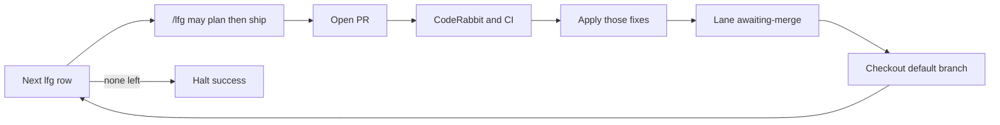
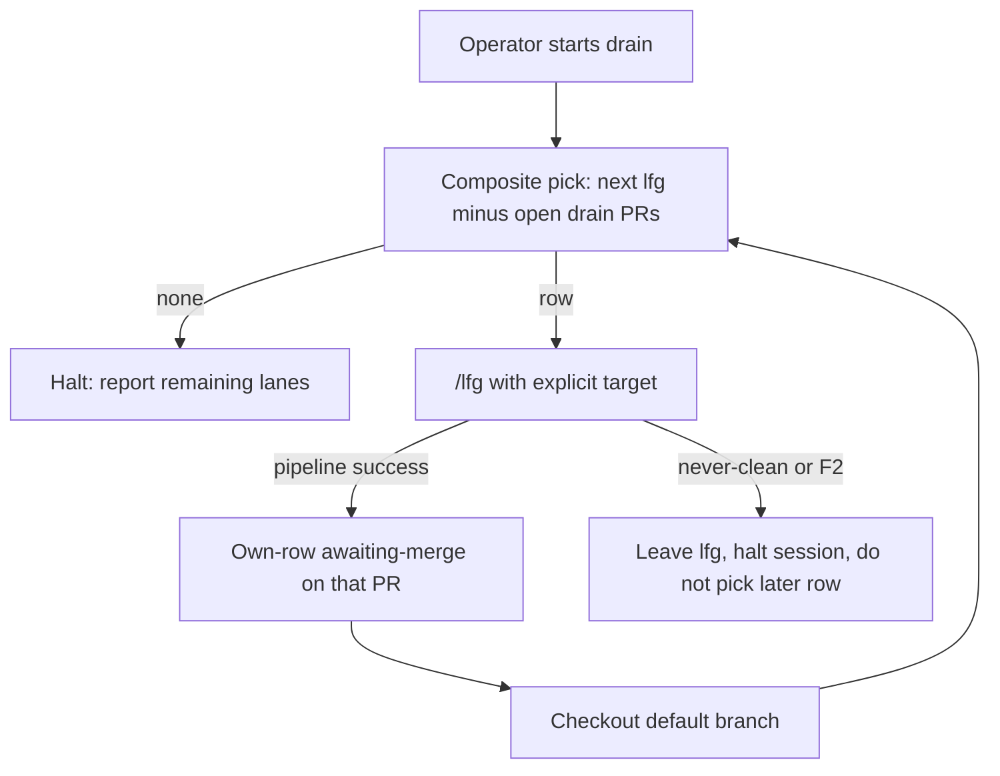

# Drain Board LFG Autopilot - Plan

## Goal Capsule

- **Objective:** Make the personal-tool board drainable by `/lfg`: every outstanding row has an explicit lane, the agent takes the next `lfg` row through PR + CodeRabbit + CI, then the next, and halts when none remain.
- **Product authority:** This Product Contract. `STRATEGY.md` remains product thesis. `docs/plans/README.md` remains the milestone board.
- **Open blockers:** None.
- **Product Contract preservation:** restructured, no scope change: R4 plan-then-implement stays in-cycle via full `/lfg` (not drain-side `ce-plan`); R3 pick composes open PRs; R5 clean = babysit pipeline success.

---

## Product Contract

### Summary

Give each outstanding board row an explicit lane (`lfg` / `operator` / `parked` / `awaiting-merge`).
The operator kicks off drain.
The agent picks the next `lfg` row, runs `/lfg` for that row (which may write the plan if the row still needs one), marks the row `awaiting-merge` on that item's PR, checks out the default branch, then starts the next.
Halt when no `lfg` row remains.
The operator merges on their own time.

### Problem Frame

The operator wants the rest of implementation on autopilot: a roadmap, then one `/lfg` per outstanding item, review, PR.
After judge retirement and a STRATEGY-aligned README, Active correctly says there is no in-progress plan.
Residual eval-parse tests (#38) is the named leftover; parity and inbox scan still need plans; in-field submit bar is operator work.
Blank `/ce-work` can still glob the newest `implementation-ready` plan file even when that milestone is done on the README, so an unsupervised loop will re-enter retired work instead of halting or draining real leftovers.

### Key Decisions

- **One work unit: lanes + drain procedure + halt.** `(session-settled: user-directed — chosen over splitting safety / queue-shaping / runner into separate plans: autopilot needs all three together)` Governs R1, R7, R8.
- **Lanes live on the existing README, not a second workset.** `(session-settled: user-approved — chosen over a new workset file or /ce-next skill: one source of what's next)` Governs R1, R2.
- **`/lfg` may create the plan for a `needs plan` `lfg` row, then implement it.** `(session-settled: user-directed — chosen over skip or ask-first: otherwise the queue dies after #38)` Governs R4, F1.
- **PR first, then CodeRabbit and CI, apply those fixes, stop for operator merge.** `(session-settled: user-directed — chosen over agent-review-before-PR or auto-merge)` Governs R5, R6, F1.
- **Start the next `lfg` row once the current PR is CodeRabbit-clean, not after merge.** `(session-settled: user-directed — chosen over waiting on merge or fanning out parallel work)` Governs R6, F1.
- **Pick the README lane, never a leftover `implementation-ready` stamp.** Governs R3, AE2.
- **Do not rename todo files or rewrite historical plan bodies.** `(session-settled: user-directed — chosen over filename migration / reprinting museum plans)` Governs R9.

### Actors

- A1. Operator — kicks off drain, merges PRs, owns `operator` rows (submit bar).
- A2. Drain agent — iterates `lfg` rows per F1.
- A3. `/lfg` pipeline — plans if needed, implements, opens the PR.
- A4. CodeRabbit and CI — the review gate before `awaiting-merge`.

### Requirements

**Board**

- R1. Outstanding rows are non-done milestone rows, named leftovers, and the Active operator-focus line. Completed milestones are not outstanding and do not take a lane. Finish-line backlog marked omitted is outside this set. Every outstanding row on `docs/plans/README.md` has exactly one lane: `lfg`, `operator`, `parked`, or `awaiting-merge`.
- R2. Residual eval-parse unit tests (GitHub #38), inbox scan, and cross-model parity appear as `lfg` rows. STRATEGY “Not working on” items and in-field submit-bar work are not `lfg`. Closed review todos are not `lfg`. README backlog deferred beyond the personal-tool finish line (frontend, multi-user, learning, tenure honesty) is `parked` or omitted, never `lfg`.

**Pick**

- R3. Drain selects the next `lfg` row from the README in board order: (1) Active named leftovers top-to-bottom, (2) milestones table non-done top-to-bottom, (3) backlog bullets. Skip non-`lfg` lanes and rows that already have an open drain PR. It must not select a plan because the file is newest or still `implementation-ready` after the milestone is done. Drain invokes `/lfg` with an explicit target taken from that row. After `/lfg` returns, drain re-reads README lanes plus open PRs for the next pick and ignores any `/lfg` next-work handoff. `/lfg` DONE returns control to drain; it is not session halt.
- R4. A `needs plan` `lfg` row is pickable only if the README row already names a bounded problem, a STRATEGY or README pointer, and a success bar. Unbounded rows stay `operator` or `parked` and are not planned in-cycle. If a pickable row still needs a plan, drain invokes full `/lfg` with that target so `/lfg` writes the plan and implements. AGENTS internal-ambiguity halt still applies (architecture, auth, billing, data model).

**Cycle**

- R5. Per-item PR, CodeRabbit, CI, and review-fix apply are delegated to one `/lfg` invocation. Drain does not re-implement that tail. CodeRabbit-clean for drain means babysit pipeline success (CI clean, merge state clean, no actionable babysit backlog). When `/lfg` cannot reach that within its bounded retry policy, drain halts that row, leaves it `lfg`, reports the blocker, and does not start the next row.
- R6. When that PR is CodeRabbit-clean, drain marks the row `awaiting-merge` with an own-row edit on that item's PR (never on `main`). If another `lfg` row exists after the composite pick, drain checks out the default branch and starts the next row on a new branch without waiting for merge. Drain must not append to the previous item's PR. Merge remains A1.
- R7. When no `lfg` row remains, drain halts and reports remaining `operator`, `parked`, and `awaiting-merge` rows. An empty `lfg` set is success, not a prompt to invent work.

**Safety**

- R8. Drain must be an invoked procedure the operator starts. It is not a daemon. `/lfg` remains the per-item pipeline; drain is the iterator.
- R9. Drain does not rename todo files and does not rewrite historical plan bodies.

### Key Flows

- F1. Drain one row then the next
  - **Trigger:** Operator starts drain.
  - **Actors:** A1, A2, A3, A4.
  - **Steps:** Pick next `lfg` row per R3. If it needs a plan and is pickable per R4, invoke full `/lfg` with that target. `/lfg` owns PR, CodeRabbit, CI, and those fixes per R5. On CodeRabbit-clean: own-row `awaiting-merge` on that PR, check out the default branch, then if another `lfg` row exists repeat per R6; else halt per R7. On never-clean: halt that row per R5. Do not skip F2 by picking a later row.
  - **Outcome:** Zero or more CodeRabbit-clean PRs waiting on merge, each on its own branch from the default branch; no invented work from done plan stamps or closed todos.
  - **Covered by:** R3, R4, R5, R6, R7, R8.

- F2. Ambiguity mid-drain
  - **Trigger:** Internal ambiguity during `/lfg` on a `needs plan` row (architecture, auth, billing, data model).
  - **Actors:** A2, A1.
  - **Steps:** Halt that row without guessing. Leave it `lfg`. Do not skip to a later row as a way to dodge the halt. A1 unsticks by re-laning to `operator` or `parked`.
  - **Outcome:** Operator is asked; drain does not silently scope a new product surface.
  - **Covered by:** R4.

### Acceptance Examples

- AE1. Residual is pickable
  - **Covers R2, R3.**
  - **Given:** The board has #38 as `lfg` and no other `lfg` rows.
  - **When:** Operator starts drain.
  - **Then:** Drain runs `/lfg` on #38, not on a done retire-judges plan file.

- AE2. Done milestone, live stamp
  - **Covers R3.**
  - **Given:** A plan file is still `implementation-ready` and newest by date, and the README marks that milestone done.
  - **When:** Drain picks the next job (or blank `/ce-work` would have globbed that file).
  - **Then:** That file is not selected.

- AE3. Needs-plan row
  - **Covers R4.**
  - **Given:** An `lfg` row is pickable (bounded problem, STRATEGY or README pointer, success bar) and still says needs plan (e.g. inbox scan).
  - **When:** It becomes the next pick and no AGENTS halt fires.
  - **Then:** One `/lfg` invocation writes the plan and implements it in that cycle.

- AE4. Halt is success
  - **Covers R7.**
  - **Given:** No outstanding row is `lfg`. Completed milestones are not outstanding rows subject to R1.
  - **When:** Operator starts drain.
  - **Then:** Drain does no implementation and reports the remaining lanes.

- AE5. Stacked PRs
  - **Covers R5, R6.**
  - **Given:** Item A’s PR is CodeRabbit-clean and unmerged; item B is `lfg`.
  - **When:** Drain continues from a fresh checkout of the default branch.
  - **Then:** A is `awaiting-merge` on A’s PR; drain starts B from the default branch, not A’s PR branch, and does not re-select A. Nothing is merged without A1.

- AE6. Submit bar stays off the queue
  - **Covers R2.**
  - **Given:** In-field submit bar is `operator`.
  - **When:** Drain runs.
  - **Then:** It does not start curator-prompt work.

### Success Criteria

- An operator can start drain and get a CodeRabbit-clean PR per `lfg` row without steering between items.
- A cold agent reading the README can name the next `lfg` row without opening plan files by date.
- Halt with no `lfg` rows does not produce a speculative implementation PR.

### Scope Boundaries

**Deferred for later**

- Auto-merge.
- Implementing #38, inbox scan, or cross-model parity *in this* change — they become `lfg` rows.
- Prompt-craft / submit-bar as drain work.

**Outside this product's identity**

- A second workset file or `/ce-next` skill as the source of “what's next.”
- Renaming todos or rewriting historical plan bodies so filenames look true.
- Parked STRATEGY bets (LLM-as-judge, flexible as commercial path) as `lfg` work.
- README backlog deferred beyond the personal-tool finish line as `lfg` work.
- Unattended merge or a background daemon that drains without operator kickoff.

<!-- ce-section: work-relationships -->
### How This Work Fits Together

This plan owns **lanes, drain iteration, and halt**.
Later `/lfg` cycles consume rows; they are not this plan's implementation units.

- Eval-parse unit tests (#38) — **Depends on** this plan making the row `lfg`. **Can proceed independently** as the first drain item after lanes exist.
- Two fronts / inbox scan — **Depends on** R4 (bounded README row, then plan-inside-`/lfg`) unless a human writes the plan first. **Still to decide** at drain time if AGENTS halt fires.
- Cross-model parity — same relationship as inbox scan.
- In-field submit bar — **Can proceed independently** as `operator` work. Not a drain item.

### Dependencies / Assumptions

- `/lfg` (compound-engineering) is the per-item shipping pipeline. It does not iterate the README today; drain is the missing iterator (R8).
- `docs/plans/README.md` is already the session-start north-star (`AGENTS.md`).
- Blank `/ce-work` glob of newest `implementation-ready` + `execution: code` can disagree with README Active; R3 exists because of that.

### Outstanding Questions

None blocking.
Kickoff surface, CodeRabbit-clean definition, and README lane field shape are resolved in the Planning Contract.

### Sources / Research

- `docs/plans/README.md` — Active currently none in progress; leftover #38; M7/M8 need plan.
- `STRATEGY.md` — Not working on: flexible commercial path, LLM-as-judge.
- `docs/residual-review-findings/feature-retire-llm-judges.md` — eval-parse tests, GitHub #38.
- `docs/plans/2026-07-30-001-feat-judge-model-bakeoff-plan.md` — superseded overlay pattern.
- Compound-engineering `/lfg` skill — per-item plan/work/review/PR; not README iteration.
- `ce-work` blank glob vs README Active — pick-by-stamp hazard (R3).

---

## Planning Contract

### Key Technical Decisions

- KTD1. **Drain is an AGENTS.md procedure wrapping `/lfg`, not a new skill or slash command.** `(session-settled: user-approved — chosen over a `/lfg` argument or new command this change: `/lfg` stays the per-item pipeline)` Governs R8, U2.
- KTD2. **CodeRabbit-clean for drain is babysit pipeline success.** `(session-settled: user-approved — chosen over waiting until every review thread is closed: `/lfg` already stops there)` Late comments after DONE are operator merge-time. Governs R5, U2.
- KTD3. **Composite pick: README `lfg` rows minus rows with an open drain PR. Lane edits are own-row only, on the item PR, never on `main`.** Rescues stacked PRs without a second workset. Governs R3, R6, AE5, U1, U2.
- KTD4. **Board invariant tests extend `tests/plans-readme.test.ts`.** `(session-settled: user-approved — chosen over docs-only with no tests)` Parse outstanding rows and lane enum; do not test heading prose. Governs R1, U3.
- KTD5. **Needs-plan rows invoke full `/lfg`; drain does not pre-run `ce-plan`.** `(session-settled: user-approved — chosen over drain-side plan then a partial ship: the plugin has no implement-only entry)` Governs R4, AE3, U2.
- KTD6. **F2 freeze is intended.** A blocked row stays `lfg` so the next kickoff re-selects it. A1 unsticks by re-laning. No fifth lane. Governs F2.

### High-Level Technical Design

Drain is pick → invoke `/lfg` → interpret return → lane or halt.
Shared workspace objects are README rows and GitHub PRs.
Session skip-lists are not durable across kickoffs.

### Assumptions

- Operator kickoff is an explicit utterance that names drain (exact wording is execution-time).
- `gh pr list` is available to the drain agent the same way `/lfg` already uses `gh`.
- M7 and M8 can be made pickable in U1 by adding a bounded problem, pointer, and success bar on those README rows without writing their implementation plans in this change.
- Blank `/ce-work` and `.cursor/commands/ce-work-tiered.md` glob hazards remain for agents that bypass drain; this plan does not patch those actuators.

### Sequencing

1. U3 red — lane-invariant tests against the pre-U1 README.
2. U1 green — lane the board (Active leftovers first, then table, then backlog).
3. U2 — AGENTS drain procedure (depends on U1 so the procedure has rows to name).

### Deferred to Follow-Up Work

- Optional slash-command alias for the AGENTS drain procedure.
- Tightening blank `/ce-work` and `ce-work-tiered` so non-drain agents cannot glob done `implementation-ready` stamps.
- README column vs in-cell badge cosmetics once the parseable lane field exists.

### System-Wide Impact

Agents reading AGENTS.md gain an explicit exception: operator-started drain may run when Active says no in-progress plan.
Blank `/ce-work` still must not invent work from museum stamps (AE2).
Nested `/lfg` from drain is supported; drain ignores `/lfg` next-work handoff.

### Risks and Dependencies

- Stacked unmerged PRs that touch the same modules can conflict on merge; own-row README diffs reduce README clobber, not code clobber.
- `/lfg` babysit can return success with parked `needs-human` residuals; KTD2 treats that as clean for drain and leaves late comments to A1 at merge.
- Plugin `/lfg` lives outside this repo; this plan must not require `/lfg` skill edits.

---

## Implementation Units

### U1. Lane outstanding README rows

**Goal:** Every outstanding board row has exactly one lane, and needs-plan `lfg` rows are pickable per R4.

**Requirements:** R1, R2, AE1, AE6.

**Dependencies:** none.

**Files:** `docs/plans/README.md`.

**Approach:**

1. Add a parseable `Lane` field on the same outstanding set as R1 (non-done milestones, named leftovers, Active operator-focus line). Use one encoding per region (table column; Active/backlog `Lane:` suffix).
2. Assign: #38 `lfg`; M7 and M8 `lfg` with STRATEGY or README pointer (Unblocks text is the success bar); submit bar `operator`; M3 and STRATEGY-parked / finish-line backlog `parked` or omitted; closed todos not `lfg`; this drain plan itself is `operator` while in flight, then omitted when shipped.
3. Update How to update so operators maintain lanes the same way as status.
4. Do not rewrite historical plan bodies or todo filenames.

**Patterns to follow:** Existing README milestone table and backlog bullets; museum overlay (README is liveness, plan files stay).

**Test scenarios:** Covered by U3. Manual: a cold read of the README names #38 as the first `lfg` row.

**Verification:** Outstanding non-done rows each show one of the four lane values; done milestones have no lane.

**Covers:** R1, R2, AE1, AE6.

---

### U2. AGENTS drain procedure

**Goal:** An operator-started iterator that picks by lane, invokes `/lfg`, and halts.

**Requirements:** R3, R4, R5, R6, R7, R8, R9, F1, F2, AE2, AE3, AE4, AE5.

**Dependencies:** U1.

**Files:** `AGENTS.md`, `CONCEPTS.md`.

**Approach:**

1. Add a Drain procedure under Agent workflow / Context Discipline: operator kickoff; composite pick (KTD3); invoke `/lfg` with the row's explicit target (KTD5); interpret babysit pipeline success (KTD2); own-row `awaiting-merge` on the item PR; checkout default branch; ignore `/lfg` next-work handoff; halt report (R7); F2 freeze (KTD6).
2. State the Active-empty exception: operator-started drain may pick `lfg` rows when Active says no in-progress plan; blank `/ce-work` still must not glob museum stamps (AE2).
3. Keep the Drain procedure only in `AGENTS.md`. `CONCEPTS.md` gets a one-line pointer to that procedure plus glossary stubs for any missing terms (composite pick, babysit-clean) — not a parallel procedure.
4. Do not add a repo slash command or edit the plugin `/lfg` skill.

**Patterns to follow:** Existing AGENTS Git Branch Safety (`git branch --show-current`, never write on `main`); Uncertainty halt; README-first session start.

**Execution note:** This is procedure and vocabulary, not a new runtime module; prefer the U3 invariant plus a manual AE walkthrough over inventing a drain parser.

**Test scenarios:**

- Covers AE2. Drain pick does not select a done milestone's `implementation-ready` plan file.
- Covers AE3. A pickable needs-plan row is handed to `/lfg` as the target, not pre-planned by drain.
- Covers AE4. Empty `lfg` set produces a halt report and no implementation PR.
- Covers AE5. After A's PR is clean and unmerged, drain from default branch starts B and does not re-select A.
- Covers F2. Ambiguity halt leaves the row `lfg` and does not start a later row.

**Verification:** An implementer can execute F1 from AGENTS.md without inventing pick order, branch policy, or clean definition.

**Covers:** R3, R4, R5, R6, R7, R8, R9, F1, F2, AE2, AE3, AE4, AE5.

---

### U3. Outstanding-row lane invariant

**Goal:** Catch a board that is missing a lane or using an illegal lane value.

**Requirements:** R1, KTD4.

**Dependencies:** none (red tests first; U1 makes them pass).

**Files:** `tests/plans-readme.test.ts`.

**Approach:**

1. Extend the existing README cross-file tests.
2. Assert every outstanding (non-`done` milestone plus named leftover) row has exactly one of `lfg`, `operator`, `parked`, `awaiting-merge`.
3. Assert `lfg` needs-plan rows include a bounded pointer (enough that R4 pickability is not vacuously true).
4. Do not assert heading names or How-to-update prose.

**Patterns to follow:** `tests/plans-readme.test.ts` (`node:test`, `fs`, fail with the missing path or row in the message).

**Execution note:** Implement the new assertions test-first against the pre-U1 README (red), then keep them green after U1.

**Test scenarios:**

- Covers R1. Outstanding row with no lane → fail.
- Outstanding row with a fifth lane token → fail.
- Done milestone without a lane → pass.
- Current U1 README → pass.

**Verification:** `npm test -- tests/plans-readme.test.ts` fails on a missing lane and passes on the laned board.

**Covers:** R1.

---

## Verification Contract

| Command | Applies to | Purpose |
|---------|------------|---------|
| `npm test -- tests/plans-readme.test.ts` | U3 | Lane invariant + existing plan-link checks |
| `npm test` | all | No regressions |
| `npm run lint` | all | AGENTS.md / README edits |

Manual after U1+U2:

- Cold README read names the next `lfg` row without opening plan files by date (success criterion 2, AE1).
- AGENTS Drain section names composite pick, babysit-clean, own-row lane edit, default-branch checkout, F2 freeze, and halt report (F1, AE4, AE5).

---

## Definition of Done

**Global:**

- Outstanding README rows have exactly one valid lane (R1, R2).
- AGENTS.md contains an operator-started drain procedure wrapping `/lfg` (R8).
- `tests/plans-readme.test.ts` encodes the lane invariant and passes.
- `npm test` and `npm run lint` pass.
- No workset file, `/ce-next` skill, todo rename, museum plan rewrite, daemon, or auto-merge (scope boundaries).
- Abandoned-attempt docs or helper scripts from this change are removed from the diff.

**Per unit:**

- **U1 done:** #38, M7, and M8 are `lfg` (M7/M8 pickable); submit bar is `operator`; parked identity work is not `lfg`.
- **U2 done:** A drain agent can run F1 from AGENTS.md; CONCEPTS Drain matches.
- **U3 done:** Missing or illegal lane fails the test; current README passes.

---

## Deferred / Open Questions

### From 2026-09-05 review

- **Blocked autopilot row can freeze the queue** — Key Flows (ambiguity halt) (P1, adversarial, confidence 75)

  After an internal halt, the blocked row still looks pickable, so the next kickoff re-selects it and later work never starts.
  Planning resolved this as KTD6 (intended freeze; operator re-lanes to unstick).
  Left here as the review trail, not a blocking question.
