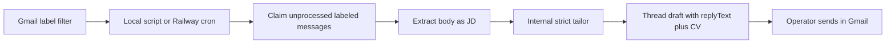

# Inbox Worker - Plan

## Goal Capsule

- **Objective:** Run unattended inbound recruiter drafts in this CCC process: scan a Gmail label, strict-tailor the message body, put grounded reply email text in a thread draft, attach the CV `.docx`.
- **Product authority:** This Product Contract. `STRATEGY.md` remains product thesis. `docs/plans/README.md` remains the milestone board and drain order.
- **Open blockers:** None.

---

## Product Contract

### Summary

Keep tailor as one API in this repo and add the inbox front here too: no product UI in v1.
`POST /api/tailor-cv` in `strict` returns recruiter reply email text plus the existing CV artifacts.
A local-first scan job, the same one Railway can schedule later, lists labeled mail, tailors unprocessed messages internally, and creates a Gmail reply draft with that body and the `.docx` attached.
The operator still sends from Gmail.

### Problem Frame

The tailor API is shippable; inbound still dies in the inbox.
Smoke can produce a CV, but the operator still copies a JD by hand and has no sendable reply on the strict path.
A separate frontend repo is empty and is not required for that loop.

### Key Decisions

- **Inbox worker lives in this CCC process, not a frontend.** `(session-settled: user-directed — chosen over a separate ccc-frontend service or putting scan-only on Vercel: Gmail drafts are the review surface; the tailor API stays one Railway service)` Governs R8, R13, R14, R16.
- **Local first, same job on Railway.** `(session-settled: user-approved — chosen over local-only or deploy-first: prove the loop with npm run dev; M8.6 only turns on the schedule)` Governs R13, R14.
- **Strict success includes recruiter reply email text.** `(session-settled: user-directed — chosen over attach-only Gmail drafts: MVP is a sendable thread draft plus CV)` Governs R1, R2, R3, R5, R10.
- **Reply is email body, not a second cover-letter `.docx`.** `(session-settled: user-approved — chosen over attaching a formal letter file: Gmail body is the send path; flexible coverLetter stays off the commercial path)` Governs R2, R10.
- **Drain order stays as merged.** `(session-settled: user-directed — chosen over parking M7/#38 to start inbox first: composite pick is #38, then M7, then M8.1)` Governs nothing in this worker; orients board consumers.

### Actors

- A1. Operator — runs local scan and smoke, reads Gmail drafts, sends, merges drain PRs, owns the submit bar.
- A2. Inbox worker — lists labeled mail, claims unprocessed ids, extracts body, calls tailor in-process, creates or reuses drafts, records processed ids.
- A3. Tailor pipeline — existing `strict` curator + mechanical `.docx`; now also emits reply text.
- A4. Gmail — recruiter label filter (operator-owned), message store, draft surface.
- A5. Railway schedule — invokes the same scan job when deployed (M8.6).

### Requirements

**Strict reply text**

- R1. A successful `strict` tailor (HTTP `POST /api/tailor-cv` and the in-process core) returns a non-empty recruiter reply-email string as `replyText` in addition to `cv`, `curatedJson`, and `builderVersion`.
  - Curator JSON (strict, same pass as the Curated CV): wrapper `{ "curated_cv": <Master CV schema>, "reply_text": "<email body>" }` — same pattern as flexible `{ curated_cv, cover_letter }`. `reply_text` is not a Master CV / `curatedJson` property (`additionalProperties: false` on `master-cv.schema.json`).
  - Extraction: `extractStructuredJson` → require `curated_cv`; read `reply_text`; schema-validate `curated_cv` only.
  - HTTP and in-process field: `replyText` (camelCase, parallel to `coverLetter`). It does not collide with existing `TailorResponseBody` keys (`cv`, `curatedJson`, `coverLetter`, `builderVersion`, `curationMode`, `model`, `usage`, `remaining`, `resetTime`).
  - Normalization: `typeof reply_text === "string"`, then `String.prototype.trim`; usable iff the trimmed string is non-empty.
  - Flexible: no `replyText`; `cover_letter` / `coverLetter` unchanged.
- R2. That string is a reply to the recruiter thread, grounded in the Master CV with the same no-invention rules as the Curated CV, and is not flexible-mode `coverLetter`.
- R3. Missing, non-string, or whitespace-only `reply_text` (after trim) on an otherwise valid strict curator result is a 422 with no `.docx`, no curated JSON, and no `replyText` in the body.
- R4. Reply text comes from the same single curator pass as the Curated CV, not a second LLM call.
- R5. `npm run smoke` in strict mode writes the reply text next to the existing smoke artifacts so the operator can judge “would you send this email?”

**Scan and draft**

- R6. The worker lists Gmail messages with a configured recruiter label (`GMAIL_RECRUITER_LABEL`).
- R7. The job-description input is the message body (text/plain, else html-to-text). No JD-isolation model in this contract.
- R8. Inbox tailor is in-process, not HTTP.
  - Entry: a core function `{ jobDescription, curationMode: "strict" }` → R1 success artifacts or an R3-equivalent failure. It shares curator + mechanical `.docx` with `POST /api/tailor-cv`.
  - Today's `buildTailorResponse(deps, NextRequest)` is the HTTP adapter (IP, Bearer, `checkRateLimit`). The worker must not call that HTTP entry, must not present `Authorization: Bearer`, and must not consume `RATE_LIMIT_MAX` / `RATE_LIMIT_SECRET_MAX` buckets. M8.4 extracts or wraps the shared core from that adapter.
  - Auth for the worker process remains R16 (server-side secrets). There is no second public tailor route.
- R9. A morning batch is processed serially with backoff.
- R10. After a successful in-process tailor, the worker creates at most one Gmail **reply draft on that thread**: body from R1 (`replyText`), CV `.docx` attached. It records the message as processed (R12) only after that draft exists.
  - Before tailor or draft: atomically claim the Gmail `messageId` in Redis so overlapping local and Railway invocations cannot both proceed. A claim is not the terminal processed mark.
  - Before creating a new draft: reuse or finalize an existing reply draft for that message if one is already on the thread (or recorded on the claim). Do not create a second draft.
  - If the process crashes or Redis fails after draft create and before the processed mark, the next scan recovers that draft via claim + existing-draft reconcile — it must not create another draft (F3, AE4).
- R11. If reply text is missing after tailor, the worker must not create a stub-bodied draft.
- R12. Processed Gmail `messageId`s persist in Upstash Redis as the terminal mark so a rerun does not tailor or draft again. Redis key layout and TTL remain planning details; claim vs processed semantics are required here.

**Runtime**

- R13. Local proof is `npm run dev` plus documented on-demand scripts (`gmail:auth`, list, `inbox:scan`). Railway is a target, not the development environment.
- R14. One scan implementation, two triggers: local script and Railway schedule. Config is env only.
- R15. Gmail OAuth is a one-shot local CLI that mints `GMAIL_REFRESH_TOKEN`; Railway uses that token. No product OAuth UI.
- R16. `TAILOR_API_KEY` and Gmail tokens stay server-side. Seekers and browsers never hold them.

### Key Flows

- F1. Unattended inbound draft
  - **Trigger:** Local `inbox:scan` or Railway schedule (~5am default per STRATEGY).
  - **Actors:** A1–A5.
  - **Steps:** List labeled messages. Atomically claim unprocessed ids (R10). Extract body. Internal strict tailor (R8). Create or reuse thread draft with reply text and `.docx` (R10). Record processed id after draft success (R12).
  - **Outcome:** Operator opens Gmail and can send after reading.
  - **Covered by:** R6–R16.

- F2. Strict HTTP tailor (no Gmail)
  - **Trigger:** Smoke or any Bearer caller posts a JD with default/strict mode.
  - **Actors:** A1, A3.
  - **Steps:** Existing auth and curation. Curator returns `{ curated_cv, reply_text }`. Validate. Render `.docx`. Return dual CV artifacts plus `replyText`. Smoke writes files (R5).
  - **Outcome:** Operator can accept or reject the reply without inbox.
  - **Covered by:** R1–R5.

- F3. Idempotent rerun
  - **Trigger:** Scan runs again on a message already drafted — including after a crash or Redis write failure that left a draft without a processed mark, or when local and Railway overlap.
  - **Actors:** A2.
  - **Steps:** Processed-id or live claim hit, or existing draft found. No second tailor when already processed. No second draft.
  - **Outcome:** One draft per message.
  - **Covered by:** R10, R12.

### Acceptance Examples

- AE1. Strict smoke includes a sendable reply
  - **Covers R1, R5.**
  - **Given:** A pinned in-field JD and a running local server.
  - **When:** Operator runs `npm run smoke`.
  - **Then:** Smoke writes a non-empty reply-text artifact plus the existing `.docx` and curated JSON.

- AE2. Blank reply fails closed
  - **Covers R3, R11.**
  - **Given:** Curator JSON that would otherwise render a CV but has no reply text.
  - **When:** Tailor runs in strict mode.
  - **Then:** HTTP 422, no CV artifacts and no `replyText` in the body; the inbox worker creates no draft.

- AE3. Local scan creates the Gmail draft
  - **Covers R10, R13.**
  - **Given:** A labeled unprocessed message and local env (including Gmail token).
  - **When:** Operator runs `npm run dev` and `npm run inbox:scan`.
  - **Then:** Gmail shows a reply draft on that thread with the reply body and an openable CV `.docx`. Deploy is not required.

- AE4. Second scan is a no-op
  - **Covers R12, F3.**
  - **Given:** That message id is already stored as processed.
  - **When:** Scan runs again.
  - **Then:** No second tailor call and no second draft.

- AE5. Flexible cover letter is unchanged
  - **Covers R2.**
  - **Given:** A `curationMode: flexible` request.
  - **When:** Tailor succeeds.
  - **Then:** Existing `coverLetter` behavior remains; inbox scan uses strict and R1, not that field.

- AE6. Crash or overlap does not duplicate drafts
  - **Covers R10, R12, F3.**
  - **Given:** Two overlapping scan triggers, or a crash / Redis failure after draft create and before the processed mark.
  - **When:** Scan runs (or continues).
  - **Then:** Still one reply draft on the thread with R1 body and CV attachment; the message ends processed. Implementation tests (M8.3 / M8.5): concurrent claims (one winner) and crash before the processed mark.

### Success Criteria

- Operator would send the smoke reply and CV for a pinned in-field JD (submit bar now includes the email).
- A local scan produces a real Gmail thread draft with body and attachment.
- Turning on Railway cron does not require a second scan implementation.

### Scope Boundaries

**Deferred for later**

- Schedule-send next workday afternoon.
- Product web UI / on-demand JD paste (`ccc-frontend`).
- Other mail providers.
- JD isolation from recruiter fluff.
- Second cover-letter `.docx` attachment.
- Investing in `flexible` as the commercial path.

**Outside this product's identity**

- A browser or mobile client that holds `TAILOR_API_KEY`.
- A product dashboard as the v1 review surface (Gmail is).
- Auto-merge of drain PRs.
- Putting Gmail OAuth identity into a second deployed service for v1.

<!-- ce-section: work-relationships -->
### How This Work Fits Together

This plan owns **strict reply text and the Gmail inbox worker** (README rows M8.1–M8.6).
The surrounding board is the current drain queue, not this plan's implementation units.

- Eval-parse unit tests (GitHub #38) — **Can proceed independently**. Drain composite pick takes this **first**.
- Cross-model parity (M7) — **Can proceed independently**. Drain takes this **second**.
- M8.1 Strict reply text — **Depends on** this Product Contract. First inbox `/lfg`. **Enables** M8.4–M8.5.
- M8.2 Gmail auth + list — **Can proceed independently** of M8.1. **Enables** M8.3.
- M8.3 Body extract + processed ids — **Depends on** M8.2. **Enables** M8.4. Tests: concurrent claim (two invocations, one winner); crash before processed mark still allows recovery.
- M8.4 Tailor from a message — **Depends on** M8.1 and M8.3. In-process core from R8; not `POST /api/tailor-cv`.
- M8.5 Thread draft + attach + body — **Depends on** M8.4. Tests: existing draft reused after Redis mark failure; no second draft. Local MVP complete.
- M8.6 Railway schedule — **Depends on** M8.5. Same job, scheduled trigger.
- In-field submit bar — **Can proceed independently** as `operator` work.
- On-demand UI / `ccc-frontend` — **Can proceed independently** later. Not this contract.

### Dependencies / Assumptions

- Drain procedure in `AGENTS.md` is shipped; this change does not reimplement Drain.
- Upstash Redis already exists for rate limits and is the processed-id store.
- Operator already applies a Gmail filter that sets the recruiter label.
- Google Cloud OAuth client and Gmail compose/modify scopes are operator setup, not code in M8.1.
- Public tailor rate limits stay as documented; inbox must not share those buckets (R8).

### Outstanding Questions

- **Deferred to Planning:** Gmail API scopes minimum set and draft MIME shape for `.docx` attach.
- **Deferred to Planning:** Redis key layout and TTL for processed ids (claim vs processed semantics are in R10/R12).
- **Deferred to Planning:** Whether `gmail:auth` is a standalone script or a route used only for the localhost redirect.
- **Resolve Before Planning:** None.

**Resolved in this contract**

- Strict reply payload: curator key `reply_text`, HTTP/in-process field `replyText`, wrapper + trim rule in R1/R3. No collision with existing `TailorResponseBody` keys.

### Sources / Research

- `STRATEGY.md` — Two fronts, one API; ~5am scan; human reads artifacts; flexible not the commercial path.
- `docs/api/API.md` — Bearer presenter: smoke CLI; inbox worker is in-process, not an HTTP presenter; `coverLetter` is flexible-only today.
- `docs/arch/README.md` — historically deferred reply draft; this contract lifts that for strict.
- `docs/plans/README.md` — drain lanes; composite pick order.
- `AGENTS.md` — Drain composite pick.
- Session: attach-only superseded; worker-in-CCC; local-first deployable; keep drain order #38 then M7 then M8.1.
